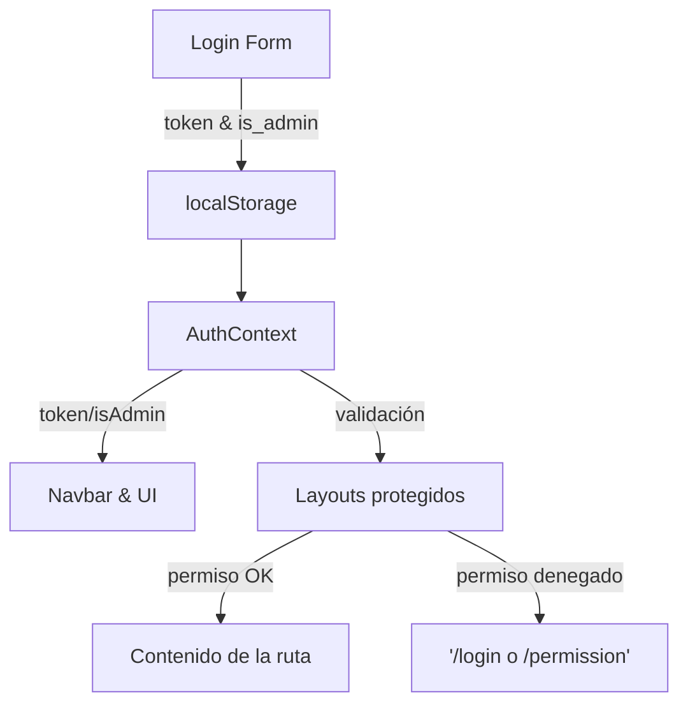
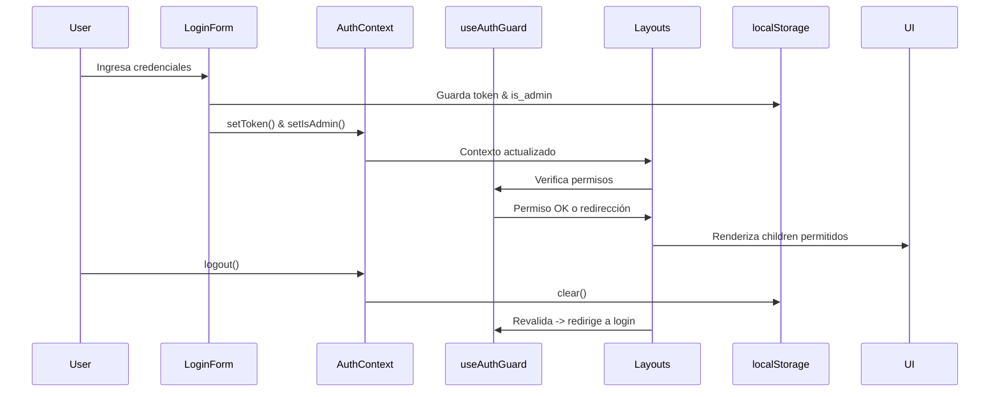
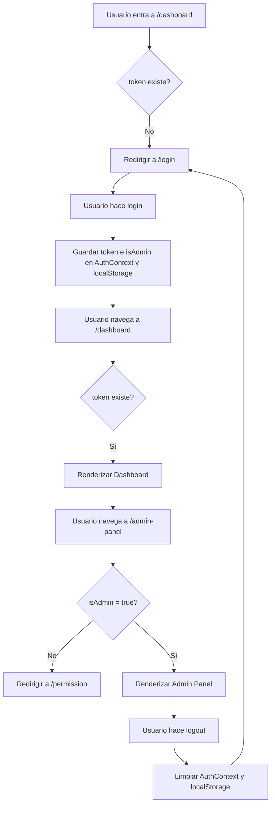

# HastagsGenerator

Este proyecto es una API de generación de hashtags a partir de imágenes, construida con **FastAPI**, **PostgreSQL**, **Docker** y con estructura de **arquitectura hexagonal (Clean Architecture)**.
Proyecto para aprender Python orientado a IA + web + arquitectura limpia

## ✅ Idea resumida como MVP
- Login / Registro de usuarios

- Subida de imagen por parte del usuario

- Selección manual de plataforma o red social para adaptación de hastags/descripciones al formato requerido

- Generador de hashtags (IA: visión por computadora o modelo entrenado o preentrenado) para aprovechar el máximo alcance en la plataforma seleccionada

- Panel de usuario (historial de imágenes subidas y hashtags generados)

- Panel de admin (ver usuarios registrados)

- Base de datos PostgreSQL

- Contenedores Docker

- Arquitectura hexagonal en Python (Clean Architecture con capas separadas: domain, application, infrastructure, interface)

## ✅ Tecnologías usadas

- Python 3.11
- FastAPI
- PostgreSQL
- SQLAlchemy
- Docker + Docker Compose
- Pydantic
- Uvicorn
- WSL (Ubuntu) en Windows (opcional pero recomendado)
- Arquitectura hexagonal


## 🧠 Tecnologías sugeridas por capa
| Capa | Tecnología     |
| :-------- | :------- | 
| `Interfaz`      | `FastAPI (backend API REST) + React (opcional)` |
| `Infraestructura`      | `SQLAlchemy / Tortoise ORM, PostgreSQL, Docker, JWT` |
| `Aplicación`      | `Casos de uso, DTOs (puros Python)` | 
| `Dominio`      | `Entidades puras, sin dependencias` | 
| `IA`      | `Transformers, CLIP, torchvision, YOLO, etc. para extracción de contenido visual o tags` | 

## 🧱 Estructura de carpetas hexagonal en Python (inspirada en tu backend NestJS)
```
project/
│
├── app/                        # Backend FastAPI
│   ├── domain/                 # Entidades y puertos
│   │   ├── entities/
│   │   ├── repositories/         # Equivalente a /ports en NestJs
│   │   └── services/
│   ├── application/           # Casos de uso
│   │   └── use_cases/
│   ├── infrastructure/        # Implementaciones reales
│   │   ├── db/ (models, SQLAlchemy) # Acceso a la bd
|   |   |    ├── models/         # Modelos ORM (SQLAlchemy)
|   |   |    └── repositories/   # Implementaciones concretas de los puertos (lógica para acceder a los datos). Equivalente a /persistence en NestJS
|   |   ├── dto/                # Para adaptar datos HTTP a entidades o viceversa
|   |   ├── mappers/            # 	Para transformar entre entidades de dominio ↔ modelos ORM ↔ DTOs
│   │   ├── services/ (ej. IA, imágenes)
|   |   ├── scheduler/           # tareas programadas
|   |   ├── auth/                # autenticación (si aplica)
│   ├── interfaces/            # API REST (FastAPI routers) / endpoints REST
|   ├── requirements.txt
|   ├── Dockerfile
│   └── main.py                # Arranque de la app
│
├── frontend/                # Frontend basado en NextJs
|   ├── src/
│   ├── app/
│   │   ├── page.tsx              # página raíz
│   │   └── layout.tsx            # layout global
│   ├── components/
|   ├── services/                 # llamadas a la API
|   ├── Dockerfile
|   ├── Resto de archivos               
├── docker-compose.yml
└── .env
```
## 🧠 Equivalencias con NestJS
| NestJS | FastAPI     |
| :-------- | :------- | 
| `/domain/entities/`      | `/domain/entities/` |
| `/domain/ports/`      | `	/domain/repositories/ (en este caso)` |
| `/infrastructure/persistence/`      | `/infrastructure/db/repositories/` |
| `/infrastructure/controllers/`      | `/interfaces/loquesea.router.py` |
| `/infrastructure/dto/`      | `/infrastructure/dto/` | 
| `/infrastructure/mappers/`      | `/infrastructure/mappers/` | 
| `/infrastructure/services/`      | `/infrastructure/services/` | 
| `/infrastructure/scheduler/`      | `/infrastructure/scheduler/` | 

En NestJS sueles agrupar por dominio funcional, aquí en Python preferimos agrupar por tipo de tecnología dentro de infraestructura, lo que sigue siendo muy limpio y flexible.
- Esta estructura es igual de válida que en NestJS, pero orientada a claridad técnica en vez de modularidad de dominio

## 🧩 Fases del proyecto
### 🟩 Fase 1: Login, registro, panel básico
- Usuarios con login/registro (JWT con `python-jose[cryptography]` y `passlib[bcrypt]`)

- PostgreSQL como base de datos

- Docker Compose con FastAPI + Postgres

- Arquitectura hexagonal base

### 🟨 Fase 2: Subida de imágenes
- Upload de imagen (guardar en local o S3/MinIO)

- Asociación imagen ↔ usuario

### 🟧 Fase 3: Generador de hashtags
- Usa modelo de IA como CLIP de OpenAI o alguna red preentrenada (YOLOv8, torchvision, etc.)

- Puedes convertir imagen en texto y de ahí generar hashtags

- Opcional: entrenar un pequeño modelo si quieres experimentar

### 🟥 Fase 4: Panel admin y dashboard
- Lista de usuarios

- Filtro por fechas, cantidad de imágenes

- Estadísticas simples

# 🚀 Guía de despliegue local - Hashtag Generator API

Esta guía te permitirá clonar y desplegar este proyecto siguiendo arquitectura hexagonal usando Docker y FastAPI.

---
## ⚙️ Pasos para levantar el proyecto

### 1. Clona el repositorio (preferentemente dentro de WSL si usas Windows)

```bash
git clone https://github.com/tu-usuario/hashtag-generator.git
cd hashtag-generator

```
### 2. Crea el archivo .env
Este archivo contiene las variables sensibles y no está incluido en el repositorio por seguridad.
✅ También puedes usar el archivo .env.example como plantilla, está disponible en el repositorio.

```bash
touch .env
```
Añade el siguiente contenido (ajústalo si es necesario):

```
# PostgreSQL configuration - NO PÚBLICO, ES UN EJEMPLO
POSTGRES_USER=your_postgres_user
POSTGRES_PASSWORD=your_postgres_password
POSTGRES_DB=your_database_name
POSTGRES_HOST=your_postgres_host
POSTGRES_PORT=5432

# Encriptación de contraseñas y generación de tokens JWT
SECRET_KEY = "your_secret_key"
ALGORITHM = "HS256"
ACCESS_TOKEN_EXPIRE_MINUTES = 30

```

### 3. Instala dependencias **(solo si NO usas Docker)**
Si prefieres correr la app **sin** contenedores:

```bash
python -m venv venv
source venv/bin/activate
pip install -r requirements.txt
```

Para **desactivar** el entorno virtual cuando termines de trabajar, simplemente ejecuta:
```bash
deactivate
```

No elimina el entorno ni los paquetes; simplemente deja de estar activo. Cuando quieras volver a usarlo, puedes reactivarlo con:
```bash
source venv/bin/activate
(En Windows: venv\Scripts\activate)
```
---


## ▶️ Levantar el entorno con Docker 
Este proyecto incluye dos contenedores principales:

- 📦 Backend (FastAPI)

- 🖥️ Frontend (NextJs)

Para construir e iniciar todos los servicios:
```
docker-compose up --build
```
Esto iniciará: 
⚙️ FastAPI en → http://localhost:8000

🧩 Frontend en → http://localhost:3000

El contenedor del frontend ejecutará automáticamente npm install y npm run dev, así que no necesitas hacer nada más desde la terminal.

## 🧪 Endpoints disponibles (API REST)
📍 GET / → http://localhost:8000 - Verifica que la API está corriendo

📄 GET /docs → http://localhost:8000/docs - Documentación interactiva Swagger

📘 GET /redoc → http://localhost:8000/redoc - Documentación ReDoc

## 📌 Notas adicionales
- Si usas Windows, se recomienda trabajar desde **WSL con Ubuntu** para evitar problemas de rutas y permisos.

- También, asegurate de que tener instalado npm y nodejs dentro de WSL, y de tener bien configurado npm para que no esté apuntando a la instalación de Windows.

- Usa `code .` desde tu terminal WSL para abrir Visual Studio Code directamente conectado a tu entorno Linux Ubuntu.

- Asegúrate de que Docker + Docker Compose esté correctamente instalado y corriendo.

- Los contenedores se reiniciarán automáticamente en caso de fallo (restart: on-failure).

- Este proyecto está estructurado para escalar en el futuro.

- La protección de endpoints con acceso habilitado a un usuario loggeado y acceso habilitado a un usuario loggeado + tipo administrador (get_current_user y get_current_admin_user en auth_dependencies.py). No se pueden probar de momento ni desde swagger ni desde el frontend para no causar conflictos, pero está activo ya que en swagger aparece el candado identificativo

- La protección de rutas desde el Frontend en una versión inicial se comprobaba de forma manual gracias a un contexto y su uso en un componente que envolvía las páginas que componen la aplicación [Pincha aquí para saber su funcionamiento](https://github.com/maigcorrea/fastapi-hashtag-generator/blob/main/docs/protección-rutas-manual(Antigua).md). Pero se ha realizado una actualización con una versión híbrida basada en el encapsulamiento de la lógica de protección en un hook reutilizable + Layout con App Router (Consultar más abajo)

## Detalles relevanetes

### **🛡️ Protección de endpoints FastAPI OAuth2 with Password (and hashing), Bearer with JWT tokens**
El flujo de contraseñas es una de las formas (flujos) definidas en OAuth2 para gestionar la seguridad y la autenticación.

- OAuth2 se diseñó para que el backend o la API fueran independientes del servidor que autentica al usuario.

- Pero en este caso, la misma aplicación FastAPI gestionará la API y la autenticación.

🔎 Revisémoslo desde esta perspectiva simplificada:

- El usuario escribe el nombre de usuario y la contraseña en el frontend y pulsa Intro.
- El frontend (que se ejecuta en el navegador del usuario) envía ese nombre de usuario y contraseña a una URL específica en nuestra API (declarada con tokenUrl="token").
- La API comprueba ese nombre de usuario y contraseña y responde con un token JWT.
- El frontend almacena ese token JWT temporalmente en algún lugar.
- El usuario hace clic en el frontend para ir a otra sección de la aplicación web frontend.
- El frontend necesita obtener más datos de la API.
- Pero necesita autenticación para ese endpoint específico. Para autenticarse con nuestra API, se envía un encabezado "Autorización" con el valor "Bearer" más el token.
- Si el token contiene "foobar", el contenido del encabezado "Autorización" sería: "Bearer foobar".

**🔄 Flujo resumido**
El frontend envía usuario/contraseña → obtiene token JWT → lo usa en futuras peticiones.

### 🔐 Flujo de autenticación con OAuth2 + Con flujo Password JWT en FastAPI (implementación real)
**1. Generación del token JWT🔑**

En el endpoint ``` /users/login ``` después de validar las credenciales con ```pwd_context.verify()```, se genera un token JWT que incluye el user_id como sub:

```python
jwt.encode({"sub": str(user.id)}, SECRET_KEY, algorithm=ALGORITHM)
```
En este caso el token también incluye la fecha de expiración: 

- El usuario envía su email y contraseña.

- ```LoginUserUseCase``` verifica credenciales usando ```pwd_context.verify()```.

- Si son válidas, genera un JWT usando ```jose.jwt.encode()``` con:

- **sub**: ID del usuario

- **exp**: fecha de expiración

- Se devuelve al frontend junto con otros datos relevantes

Código completo:
```python
    def execute(self, dto: LoginUserDto) -> dict:
        user = self.user_repo.get_by_email(dto.email)

        if not user or not pwd_context.verify(dto.password, user.password):
            raise HTTPException(status_code=401, detail="Invalid credentials")

        payload = {
            "sub": str(user.id),
            "exp": datetime.utcnow() + timedelta(minutes=ACCESS_TOKEN_EXPIRE_MINUTES),
        }

        # Generar el token JWT

        token = jwt.encode(payload, SECRET_KEY, algorithm=ALGORITHM)
        return {
            "access_token": token,
            "is_admin": user.is_admin
        }
```

**2. Almacenar y enviar el token📤**

- El frontend guarda el token (en localStorage o memory).

- En cada petición protegida, lo incluye como header:

```
Authorization: Bearer <token>
```

**3. Validación de endpoints con dependencia get_current_user🧐**
- Extrae el token de la cabecera ```Authorization: Bearer <token>``` con ```OAuth2PasswordBearer```

- Decodifica el JWT

- Obtiene el user_id del payload (sub)

- Llama al repo para obtener el usuario real (Busca el usuario en la base de datos)

- Lanza un ```error 401``` si algo falla

- Si todo está bien, devuelve el ```current_user```

```python
def get_current_user(token: str = Depends(oauth2_scheme), ...):
    ...
    payload = jwt.decode(token, SECRET_KEY, algorithms=[ALGORITHM])
    ...
```

Código completo:
```python
def get_current_user(
    token: str = Depends(oauth2_scheme),
    user_repo: UserRepository = Depends(get_user_repository)
):
    credentials_exception = HTTPException(
        status_code=status.HTTP_401_UNAUTHORIZED,
        detail="Could not validate credentials",
        headers={"WWW-Authenticate": "Bearer"},
    )

    try:
        payload = jwt.decode(token, SECRET_KEY, algorithms=[ALGORITHM])
        user_id: str = payload.get("sub")
        if user_id is None:
            raise credentials_exception
    except JWTError:
        raise credentials_exception

    user = user_repo.get_by_id(user_id)
    if user is None:
        raise credentials_exception

    return user
```

**4. Validación de endpoints con restricción por rol mediante la dependencia get_current_user🧐**

- Depende de get_current_user

- Verifica que current_user.is_admin sea True

- Lanza 403 Forbidden si no lo es

```python
def get_current_admin_user(current_user = Depends(get_current_user)):
    if not current_user.is_admin:
        raise HTTPException(status_code=403, detail="Forbidden")
    return current_user
```

Código completo:
```python
def get_current_admin_user(current_user = Depends(get_current_user)):
    if not getattr(current_user, "is_admin", False):
        raise HTTPException(
            status_code=status.HTTP_403_FORBIDDEN,
            detail="You do not have permission to access this resource",
        )
    return current_user
```

#### 🧪 Ejemplo de uso en rutas

```python
@router.get("/me")
def get_profile(current_user = Depends(get_current_user)):
    return current_user

@router.get("/admin-only")
def admin_route(current_user = Depends(get_current_admin_user)):
    return {"message": "Solo accesible por administradores"}
```

#### 🧱 Estructura del sistema
La implementación se basa en una arquitectura por capas:

- use_cases/login_user_use_case.py: genera y devuelve el token JWT

- auth_dependencies.py: contiene las dependencias get_current_user y get_current_admin_user

- user_router.py: expone las rutas /users/login, /users/ y protege rutas con Depends(get_current_user)

- user_repository_impl.py: accede a los datos reales del usuario (por email o ID)

- .env: contiene SECRET_KEY, ALGORITHM y ACCESS_TOKEN_EXPIRE_MINUTES

#### 🔑 Autenticación en Swagger
Gracias a ```OAuth2PasswordBearer(tokenUrl="/users/login")```, FastAPI añade **automáticamente** un botón “Authorize” en la documentación Swagger para probar autenticación con token Bearer.

```python
#En las dependencias
oauth2_scheme = OAuth2PasswordBearer(tokenUrl="/users/login")
```

- Haz clic en "Authorize"

- Introduce usuario y contraseña

- FastAPI obtendrá el token y lo usará en los headers automáticamente en los endpoints protegidos

(Adjuntar imagen de swagger)

#### ✅ Resultado
✅ Token seguro con expiración (exp)

✅ Verificación automática en cada endpoint con Depends

✅ Protección opcional para administradores

✅ Integración directa con Swagger y frontend


### **🔐 Sistema de Autenticación y Protección de Rutas (Frontend) con context + hook + Layout**
**⚠️IMPORTANTE:⚠️** La protección de rutas desde el Frontend en una versión anterior se comprobaba de forma manual gracias a un contexto y su uso en un componente que envuelve las páginas que componen la aplicación [Pincha aquí para saber su funcionamiento](https://github.com/maigcorrea/fastapi-hashtag-generator/blob/main/docs/protección-rutas-manual(Antigua).md). Pero se ha realizado una actualización con una versión híbrida basada en el encapsulamiento de la lógica de protección actual en un hook reutilizable + Layout con App Router (Estándar en Nextjs)

#### Arquitectura General
```
<App (Next.js)>
   └── RootLayout (app/layout.tsx)
         └── <AuthProvider> (AuthContext)
               ├── (públicas) login/, permission/, page.tsx
               ├── (private)/layout.tsx  -> usa useAuthGuard(false)
               │       ├── dashboard/page.tsx
               │       └── profile/page.tsx
               └── (admin)/layout.tsx   -> usa useAuthGuard(true)
                       └── admin-panel/page.tsx

```



**1️⃣ Creación del AuthContext**
Se creó un contexto de React (AuthContext) para centralizar el estado de autenticación de la aplicación. Este contexto expone las siguientes propiedades:

- token: token de autenticación del usuario.

- isAdmin: booleano que indica si el usuario es administrador.

- setToken y setIsAdmin: setters para actualizar el estado.

- logout: función que limpia los datos de sesión.

- isLoading: bandera de carga (en la versión final ya no es necesaria, ver optimización).

#### Código base inicial
En la versión inicial, el AuthContext obtenía el token y el rol de localStorage usando un useEffect al montar el componente:

```
useEffect(() => {
  const storedToken = localStorage.getItem("token");
  const storedAdmin = localStorage.getItem("is_admin");

  if (storedToken) setToken(storedToken);
  if (storedAdmin) setIsAdmin(storedAdmin === "true");

  setIsLoading(false);
}, []);

```

**2️⃣ Optimización: inicializar estado desde localStorage**
Para evitar el uso de useEffect y posibles parpadeos al renderizar, se optimizó la inicialización del estado directamente en el useState, leyendo localStorage de manera perezosa (lazy initialization):

```
const [isAdmin, setIsAdmin] = useState<boolean | null>(() => {
  const storedAdmin = localStorage.getItem("is_admin");
  return storedAdmin ? storedAdmin === "true" : null;
});

const [token, setToken] = useState<string>(() => {
  return localStorage.getItem("token") || "";
});
```
Con esto, el contexto ya tiene los valores cargados al momento de inicializarse, e isLoading se vuelve opcional.

**3️⃣ Listener de localStorage para sincronización entre pestañas**
Se añadió un listener de eventos storage para detectar cambios en el localStorage hechos desde otras pestañas o ventanas del navegador. Esto permite que el estado de autenticación se sincronice en tiempo real:
```
useEffect(() => {
    const handleStorageChange = (e: StorageEvent) => {
      // Si se cambió el token o is_admin en otra pestaña, actualizamos el contexto
      if (e.key === "token") {
        setToken(e.newValue || "");
      }
      // Si se cambió is_admin en otra pestaña, actualizamos el contexto
      if (e.key === "is_admin") {
        setIsAdmin(e.newValue ? e.newValue === "true" : null);
      }
      // Si se borró el localStorage completo (logout)
      if (e.key === null) {
        setToken("");
        setIsAdmin(null);
      }
    };

    // Añadimos el listener al evento de storage para detectar cambios en localStorage
    window.addEventListener("storage", handleStorageChange);
    // Limpiamos el listener al desmontar el componente
    // Esto es importante para evitar fugas de memoria y comportamientos inesperados
    return () => window.removeEventListener("storage", handleStorageChange);
  }, []);
```

**4️⃣ Actualización del contexto en ciertas partes de la aplicación, por ej el login**
En el formulario de login, al autenticarse correctamente, se guardan los datos en localStorage y se actualiza el contexto para que el resto de la aplicación pueda reaccionar en tiempo real (por ejemplo, mostrar el Navbar con el usuario logueado):

```
localStorage.setItem("token", data.access_token);
localStorage.setItem("is_admin", String(data.is_admin));

// Actualizar contexto
setToken(data.access_token);
setIsAdmin(data.is_admin);
```
Esto permite que, al hacer login, las rutas protegidas se desbloqueen sin necesidad de recargar la página.

**5️⃣ Hook useAuthGuard**
Centralizamos la lógica de protección en un hook reutilizable:
```ts
'use client';

import { useContext, useEffect, useState } from 'react';
import { useRouter } from 'next/navigation';
import { AuthContext } from '@/context/AuthContext';

export function useAuthGuard(adminOnly = false) {
  const { token, isAdmin, isLoading } = useContext(AuthContext);
  const router = useRouter();
  const [authorized, setAuthorized] = useState(false);

  useEffect(() => {
    // Si todavía se está cargando el contexto, no hacemos nada
    if (isLoading) return;

    // Si no hay token -> login
    if (!token) {
      router.push('/login');
      return;
    }

    // Si la ruta requiere admin y el usuario no lo es -> acceso denegado
    if (adminOnly && !isAdmin) {
      router.push('/permission');
      return;
    }

    // Si todo OK -> autorizado
    setAuthorized(true);
  }, [token, isAdmin, isLoading, adminOnly, router]);

  return { authorized, isLoading };
}

```
#### Ventajas del hook:
- Se puede usar tanto en Layouts como en componentes concretos (ej: un botón o sección de UI).

- Toda la lógica de redirección y validación está centralizada.

- Si quieres proteger un componente dentro de una página, puedes usar directamente el hook:
```
const { authorized } = useAuthGuard(true); // solo admins

if (!authorized) return null;

return <button>Eliminar usuarios</button>;

```

**6️⃣ Implementación con Layouts protegidos (Next.js App Router)**
En vez de envolver cada página con <ProtectRoutes>, ahora protegemos grupos de rutas con layouts.

#### Estructura general
```
app/
├─ layout.tsx                 Layout global de toda la app
├─ page.tsx                   Página pública (ej: Home)
│
├─ login/
│   └─ page.tsx               Página pública de login
│
├─ permission/
│   └─ page.tsx               Página de "Acceso denegado"
│
├─ (private)/                 Grupo de rutas privadas (cualquier usuario logueado)
│   ├─ layout.tsx             Layout con useAuthGuard(false)
│   ├─ dashboard/
│   │   └─ page.tsx           Panel privado (cualquier usuario)
│   ├─ profile/
│   │   └─ page.tsx           Perfil del usuario
│   └─ tasks/
│       └─ page.tsx           Otra ruta privada
│
├─ (admin)/                   Grupo de rutas solo para admins
│   ├─ layout.tsx             Layout con useAuthGuard(true)
│   └─ admin-panel/
│       └─ page.tsx           Panel exclusivo de admins

```
#### ¿Cómo funcionan los grupos (private) y (admin)?
- (private)
  - Todas las páginas dentro de esa carpeta comparten el layout.tsx de (private)
  - Ese layout usa useAuthGuard(false) → solo requiere que el usuario esté logueado.


- (admin)
  - Todas las páginas dentro de esa carpeta comparten el layout.tsx de (admin)
  - Ese layout usa useAuthGuard(true) → requiere ser admin

#### Flujo de validación de los layouts
```
flowchart TD
  A[Token existe?] -->|NO| B[redirige /login]
  A -->|SÍ| C[¿adminOnly?]
  C -->|NO| D[Renderiza children]
  C -->|SÍ| E[isAdmin true?]
  E -->|NO| F[redirige /permission]
  E -->|SÍ| D[Renderiza children]

```

*Layout para rutas privadas:*
```tsx
'use client';

import { ReactNode } from 'react';
import { useAuthGuard } from '@/hooks/useAuthGuard';

export default function PrivateLayout({ children }: { children: ReactNode }) {
  const { authorized, isLoading } = useAuthGuard(false); // false = cualquier usuario logueado

  if (isLoading || !authorized) return null;

  return <>{children}</>;
}

```

*Layout para rutas a las que sólo el admin puede acceder:*
```tsx
'use client';

import { ReactNode } from 'react';
import { useAuthGuard } from '@/hooks/useAuthGuard';

export default function AdminLayout({ children }: { children: ReactNode }) {
  const { authorized, isLoading } = useAuthGuard(true); // true = solo admins

  if (isLoading || !authorized) return null;

  return <>{children}</>;
}

```
#### ¿Qué se consigue?
- Todas las páginas dentro de (private) requieren estar logueado.

- Todas las páginas dentro de (admin) requieren además ser admin.

- Ya no hay que envolver nada manualmente, el layout se aplica automáticamente.


#### FLUJOS DE NAVEGACIÓN

##### Flujo completo (Login -> Rutas protegidas -> logout)


- No hay que poner lógica en cada página.
- Todo depende de ```token``` e ```isAdmin``` en el ```AuthContext```.


#### Beneficios de esta implementación
- Centralización del estado de autenticación en un solo lugar (```AuthContext```).

- Sincronización multi-pestaña: login y logout se propagan en tiempo real.

- Sin parpadeos: al inicializar el contexto directamente desde localStorage, evitamos renderizados intermedios incorrectos.

- Protección de grupos completos de rutas con los Layouts del App Router. 

- Se siguen podiendo proteger componentes individuales gracias al hook useAuthGuard.

- UI se actualiza automáticamente al login/logout.


## Autores
- [@maigcorrea](https://www.github.com/maigcorrea)

- © 2025 Ana Maite García Correa. Todos los derechos reservados.
No se permite el uso, copia, modificación o distribución de este software sin permiso explícito por escrito al correo anamaitegarciacorrea@gmail.com.

