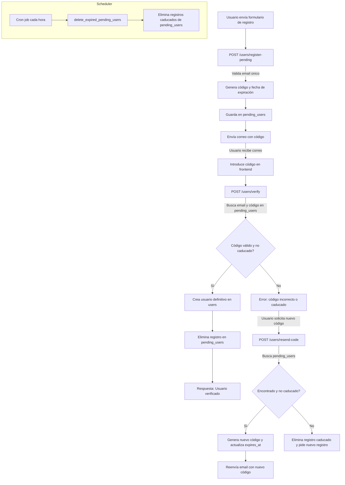
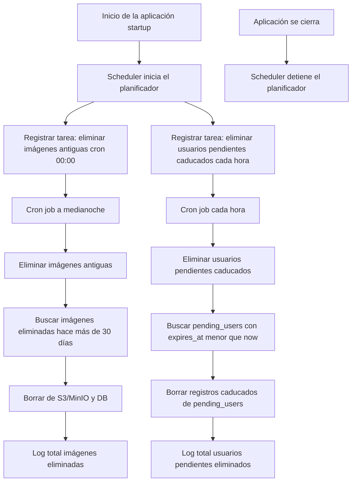

# Registro con verificación por email (FastAPI + SQLAlchemy)
## 1️⃣ Objetivo

Implementar un flujo de registro seguro donde el usuario:

1. Se registra → recibe un código de verificación por email.

2. Introduce el código → se crea su cuenta definitiva.

3. Se puede reenviar el código si no lo recibe.

4. Los registros pendientes caducados se eliminan automáticamente con un cron job.

## Flujo de registro y verificación


### Qué representa el diagrama
- Flujo principal: registro → email → verificación → creación definitiva.

- Reenvío de código: si el usuario lo solicita antes de caducar.

- Limpieza automática: cron job que borra registros caducados de pending_users.

## 2️⃣ Estructura de carpetas
```
app/
├── domain/
│   ├── entities/pending_user.py
│   ├── repositories/pending_user_repository.py
├── infrastructure/
│   ├── db/
│   │   ├── models/pending_user_model.py
│   │   ├── repositories/pending_user_repository_impl.py
│   ├── dto/
│   │   ├── user_pending_dto.py
│   │   ├── verify_user_dto.py
│   │   ├── resend_code_dto.py
│   ├── mail/email_service.py
│   ├── mappers/user_pending_mapper.py
│   ├── scheduler/
│   │   ├── delete_expired_pending_users.py
│   │   ├── delete_old_images.py
│   │   └── scheduler.py
│   ├── security/password.py
├── application/use_cases/
│   ├── create_pending_user_use_case.py
│   ├── verify_pending_user_use_case.py
│   └── resend_verification_code_use_case.py
├── interfaces/user_router.py
main.py

```

## 3️⃣ Implementación paso a paso

Cración una tabla en la que se almacenan los usuarios pre-registrados temporalmente, hasta que introduzcan el código de verificación y sean añadidos a la tabla de usuarios definitiva, o hasta que se eliminen sus datos pasado cierto tiempo sin verificar el código.

**Entidad de dominio PendingUser**

```py
from dataclasses import dataclass
from datetime import datetime
import uuid

@dataclass
class PendingUser:
    id: uuid.UUID | None
    username: str
    email: str
    password_hash: str
    verification_code: str
    created_at: datetime
    expires_at: datetime
```

**Puerto (repositorio abstracto)**
```py
from abc import ABC, abstractmethod
import uuid
from typing import Optional
from datetime import datetime
from domain.entities.pending_user import PendingUser
from infrastructure.db.models.pending_user_model import PendingUser as PendingUserModel

class PendingUserRepository(ABC):
    @abstractmethod
    def create(self, pending_user: PendingUser) -> PendingUser: ...
    @abstractmethod
    def get_by_email_and_code(self, email: str, code: str) -> Optional[PendingUser]: ...
    @abstractmethod
    def get_by_email(self, email: str) -> Optional[PendingUser]: ...
    @abstractmethod
    def delete(self, pending_user_id: uuid.UUID) -> None: ...
    @abstractmethod
    def delete_expired(self, now: datetime) -> int: ...
    @abstractmethod
    def update(self, pending_user: PendingUser) -> PendingUser: ...
    @abstractmethod
    def _to_entity(self, pending_user_model: PendingUserModel) -> PendingUser: ...

```

**Modelo SQLAlchemy**
```py
from sqlalchemy import Column, String, DateTime
from sqlalchemy.dialects.postgresql import UUID
import uuid
from infrastructure.db.db_config import Base

class PendingUser(Base):
    __tablename__ = "pending_users"

    id = Column(UUID(as_uuid=True), primary_key=True, default=uuid.uuid4)
    username = Column(String, nullable=False)
    email = Column(String, unique=True, nullable=False)
    password_hash = Column(String, nullable=False)
    verification_code = Column(String, nullable=False)
    created_at = Column(DateTime, nullable=False)
    expires_at = Column(DateTime, nullable=False)

```

**Implementación del repositorio**

```py
from sqlalchemy.orm import Session
from typing import Optional
from datetime import datetime
import uuid

from domain.entities.pending_user import PendingUser
from domain.repositories.pending_user_repository import PendingUserRepository
from infrastructure.db.models.pending_user_model import PendingUser as PendingUserModel

class PendingUserRepositoryImpl(PendingUserRepository):
    def __init__(self, session: Session):
        self.session = session

    def create(self, pending_user: PendingUser) -> PendingUser:
        model = PendingUserModel(
            id=pending_user.id or uuid.uuid4(),
            username=pending_user.username,
            email=pending_user.email,
            password_hash=pending_user.password_hash,
            verification_code=pending_user.verification_code,
            created_at=pending_user.created_at,
            expires_at=pending_user.expires_at,
        )
        self.session.add(model)
        self.session.commit()
        self.session.refresh(model)
        return self._to_entity(model)

    def update(self, pending_user: PendingUser) -> PendingUser:
        model = self.session.query(PendingUserModel).filter_by(id=pending_user.id).first()
        if model:
            model.verification_code = pending_user.verification_code
            model.expires_at = pending_user.expires_at
            self.session.commit()
            self.session.refresh(model)
            return self._to_entity(model)
        raise ValueError("Pending user not found")

    def get_by_email_and_code(self, email: str, code: str) -> Optional[PendingUser]:
        model = self.session.query(PendingUserModel).filter_by(email=email, verification_code=code).first()
        if model and model.expires_at > datetime.utcnow():
            return self._to_entity(model)
        return None

    def get_by_email(self, email: str) -> Optional[PendingUser]:
        model = self.session.query(PendingUserModel).filter_by(email=email).first()
        return self._to_entity(model) if model else None

    def delete(self, pending_user_id: uuid.UUID) -> None:
        self.session.query(PendingUserModel).filter_by(id=pending_user_id).delete()
        self.session.commit()

    def delete_expired(self, now: datetime) -> int:
        result = self.session.query(PendingUserModel).filter(PendingUserModel.expires_at < now).delete()
        self.session.commit()
        return result

    def _to_entity(self, model: PendingUserModel) -> PendingUser:
        return PendingUser(
            id=model.id,
            username=model.username,
            email=model.email,
            password_hash=model.password_hash,
            verification_code=model.verification_code,
            created_at=model.created_at,
            expires_at=model.expires_at,
        )

```

**Casos de uso**

1. Registrar usuario pendiente → ```CreatePendingUserUseCase```

2. Verificar código → ```VerifyPendingUserUseCase```

3. Reenviar código → ```ResendVerificationCodeUseCase```

📂 app/application/use_cases/create_pending_user_use_case.py
📂 app/application/use_cases/verify_pending_user_use_case.py
📂 app/application/use_cases/resend_verification_code_use_case.py

- Cada uno llama al repositorio y al ```EmailService```para enviar el correo.
- Cada caso de uso es llamado desde su correspondiente endpoint.


**Endpoints en user_router.py**
```py
@router.post("/register-pending")
def register_pending_user(dto: CreatePendingUserDto, db: Session = Depends(get_db)):
    repo = PendingUserRepositoryImpl(db)
    email_service = EmailService()
    use_case = CreatePendingUserUseCase(repo, email_service)
    return use_case.execute(dto)

@router.post("/verify")
def verify_user(dto: VerifyUserDto, db: Session = Depends(get_db)):
    pending_repo = PendingUserRepositoryImpl(db)
    user_repo = UserRepositoryImpl(db)
    use_case = VerifyPendingUserUseCase(pending_repo, user_repo)
    return use_case.execute(dto)

@router.post("/resend-code")
def resend_code(dto: ResendCodeDto, db: Session = Depends(get_db)):
    repo = PendingUserRepositoryImpl(db)
    email_service = EmailService()
    use_case = ResendVerificationCodeUseCase(repo, email_service)
    return use_case.execute(dto)

```

- ```register-pending``` para registrar a un usuario pendiente y enviar el correo con el código de verificación
- ```verify``` para verificar el código enviado
- ```resend-code``` para volver a enviar otro código en caso de que no se haya recibido inicialmente

**EmailService**
```py
import smtplib
from email.mime.text import MIMEText
from email.mime.multipart import MIMEMultipart
import os


class EmailService:
    def __init__(self):
        self.smtp_server = os.getenv("SMTP_SERVER", "smtp.gmail.com")
        self.smtp_port = int(os.getenv("SMTP_PORT", 587))
        self.smtp_user = os.getenv("SMTP_USER")
        self.smtp_password = os.getenv("SMTP_PASSWORD")

    def send_verification_email(self, to_email: str, code: str):
        subject = "Verifica tu cuenta"
        body = f"Tu código de verificación es: {code}"

        # Crear mensaje
        msg = MIMEMultipart()
        msg["From"] = self.smtp_user
        msg["To"] = to_email
        msg["Subject"] = subject
        msg.attach(MIMEText(body, "plain"))

        # Conectar y enviar
        with smtplib.SMTP(self.smtp_server, self.smtp_port) as server:
            server.starttls()
            server.login(self.smtp_user, self.smtp_password)
            server.send_message(msg)

```

**Funcionamiento:**

- Usa **SMTP** para conectarse a un servidor de correo (por defecto Gmail).

- Configura el servidor y credenciales mediante **variables de entorno**:

    - SMTP_SERVER → por defecto smtp.gmail.com.

    - SMTP_PORT → por defecto 587.

    - SMTP_USER → tu cuenta de correo.

    - SMTP_PASSWORD → la contraseña o *App Password* (si usas Gmail con 2FA).

- Construye un correo usando ```MIMEMultipart``` con el código de verificación.

- Inicia sesión en el servidor con ```server.login(...)``` y envía el mensaje con ```send_message```.

**⚠️ Nota para Gmail**: Si tienes 2FA, debes generar una contraseña de aplicación desde tu cuenta de Google (como hicimos en este proyecto).


### Cron job para limpiar caducados
Se trata de una función que se ejecuta cada hora y limpia la tabla ```pending_users```, eliminando a todos los usuarios que no han completado el proceso completo de registro y cuyo código de verificación ha caducado.

```py
from datetime import datetime
from sqlalchemy.orm import Session
from infrastructure.db.db_config import SessionLocal
from infrastructure.db.repositories.pending_user_repository_impl import PendingUserRepositoryImpl

def delete_expired_pending_users():
    print("🔹 Ejecutando limpieza de usuarios pendientes caducados...")
    db: Session = SessionLocal()
    try:
        repo = PendingUserRepositoryImpl(db)
        deleted_count = repo.delete_expired(datetime.utcnow())
        print(f"✅ Limpieza completada ({deleted_count} usuarios pendientes eliminados)")
        return deleted_count
    except Exception as e:
        print(f"❌ Error en limpieza de usuarios pendientes: {e}")
    finally:
        db.close()

```
**Scheduler centralizado**
```py
from apscheduler.schedulers.background import BackgroundScheduler
from infrastructure.scheduler.delete_old_images import delete_old_images
from infrastructure.scheduler.delete_expired_pending_users import delete_expired_pending_users

scheduler = BackgroundScheduler()

def start_scheduler():
    scheduler.add_job(lambda: print(f"🖼 Imágenes eliminadas: {delete_old_images()}"), "cron", hour=0, minute=0)
    scheduler.add_job(lambda: print(f"👤 Usuarios pendientes eliminados: {delete_expired_pending_users()}"), "interval", hours=1)

    if not scheduler.running:
        scheduler.start()
        print("⏱️ Scheduler started")

def stop_scheduler():
    if scheduler.running:
        scheduler.shutdown()
        print("🛑 Scheduler stopped")

```


#### Qué representa el diagrama?
1. Al iniciar la aplicación (startup), el scheduler.py registra dos tareas programadas:

    - Borrar imágenes antiguas (delete_old_images) una vez al día.

    - Borrar usuarios pendientes caducados (delete_expired_pending_users) cada hora.

2. Cada tarea se ejecuta de forma independiente según su programación y deja logs del resultado.

3. Al cerrar la aplicación (shutdown), el scheduler se detiene para evitar procesos colgados.


**Integración en main.py**
```py
from infrastructure.scheduler.scheduler import start_scheduler, stop_scheduler

@app.on_event("startup")
def startup():
    Base.metadata.create_all(bind=engine)
    start_scheduler()

@app.on_event("shutdown")
def shutdown_event():
    stop_scheduler()
```

## 4️⃣ Resultado final
- Registro con email (/users/register-pending)

- Verificación de código (/users/verify)

- Reenvío de código (/users/resend-code)

- Limpieza automática de usuarios pendientes caducados cada hora.
