# Frontend: Registro con verificación de email (Next.js + Axios)
## 🎯Objetivo
Implementar el flujo completo de registro y verificación de cuenta en el frontend:

1. El usuario se registra y recibe un email con un código.

2. Es redirigido a una página de verificación (/verify).

3. Introduce el código → la cuenta se activa.

4. Puede reenviar el código si no lo recibió.

## Llamadas a la API (userService)
📂 app/services/userService.ts

```ts
import axios from 'axios'

const API_URL = 'http://localhost:8000/users'

// Registro pendiente
export const registerUser = async (formData: {
  username: string
  email: string
  password: string
}) => {
  const response = await axios.post(`${API_URL}/register-pending`, formData)
  return response.data
}

// Verificar código
export const verifyUser = async (email: string, code: string) => {
  const response = await axios.post(`${API_URL}/verify`, { email, code })
  return response.data
}

// Reenviar código
export const resendVerificationCode = async (email: string) => {
  const response = await axios.post(`${API_URL}/resend-code`, { email })
  return response.data
}

```

## Formulario de registro (RegisterForm)
📂 app/components/RegisterForm.tsx

- Envía los datos a /register-pending.

- Guarda el email en localStorage.

- Redirige a /verify.

```tsx
'use client'

import { useState } from 'react'
import { useRouter } from 'next/navigation'
import axios from 'axios'
import { registerUser } from '@/app/services/userService'

export default function RegisterForm() {
  const [formData, setFormData] = useState({ username: '', email: '', password: '' })
  const [message, setMessage] = useState<string | null>(null)
  const router = useRouter()

  const handleChange = (e: React.ChangeEvent<HTMLInputElement>) => {
    setFormData({ ...formData, [e.target.name]: e.target.value })
  }

  const handleSubmit = async (e: React.FormEvent) => {
    e.preventDefault()
    try {
      await registerUser(formData)
      localStorage.setItem('pendingEmail', formData.email)
      router.push('/verify')
    } catch (error: any) {
      if (axios.isAxiosError(error) && error.response?.data?.detail) {
        setMessage(`❌ ${error.response.data.detail}`)
      } else {
        setMessage('❌ Error al registrar usuario')
      }
    }
  }

  return (
    <form onSubmit={handleSubmit} className="space-y-4 max-w-md mx-auto p-4">
      <h2 className="text-2xl font-bold mb-4">Registro</h2>
      <input type="text" name="username" placeholder="Usuario" onChange={handleChange} required className="w-full border p-2 rounded" />
      <input type="email" name="email" placeholder="Correo" onChange={handleChange} required className="w-full border p-2 rounded" />
      <input type="password" name="password" placeholder="Contraseña" onChange={handleChange} required className="w-full border p-2 rounded" />
      <button type="submit" className="bg-blue-600 text-white py-2 px-4 rounded hover:bg-blue-700">Registrarse</button>
      {message && <p className="text-center mt-4">{message}</p>}
    </form>
  )
}

```

## Página de verificación (VerifyForm + page.tsx)
📂 app/verify/page.tsx
```tsx
'use client'

import VerifyForm from '@/app/components/VerifyForm'

export default function VerifyPage() {
  return (
    <div className="max-w-md mx-auto p-6">
      <h1 className="text-2xl font-bold mb-4">Verifica tu cuenta</h1>
      <VerifyForm />
    </div>
  )
}

```

📂 app/components/VerifyForm.tsx

- Obtiene el email desde localStorage.

- Permite introducir el código de verificación.

- Botón Reenviar código con cooldown de 20 segundos.

- Botón Verificar bloqueado con spinner mientras hace la petición.

```tsx
'use client'

import { useState, useEffect } from 'react'
import { useRouter } from 'next/navigation'
import { verifyUser, resendVerificationCode } from '@/app/services/userService'
import axios from 'axios'

export default function VerifyForm() {
  const [code, setCode] = useState('')
  const [message, setMessage] = useState<string | null>(null)
  const [timeLeft, setTimeLeft] = useState(300)
  const [cooldown, setCooldown] = useState(0)
  const [loading, setLoading] = useState(false)
  const router = useRouter()

  const [email, setEmail] = useState('')
  useEffect(() => {
    const storedEmail = localStorage.getItem('pendingEmail')
    if (storedEmail) setEmail(storedEmail)
    else router.push('/register')
  }, [router])

  // Contadores
  useEffect(() => {
    if (timeLeft > 0) {
      const t = setInterval(() => setTimeLeft((v) => v - 1), 1000)
      return () => clearInterval(t)
    }
  }, [timeLeft])
  useEffect(() => {
    if (cooldown > 0) {
      const t = setInterval(() => setCooldown((v) => v - 1), 1000)
      return () => clearInterval(t)
    }
  }, [cooldown])

  const handleSubmit = async (e: React.FormEvent) => {
    e.preventDefault()
    setLoading(true)
    try {
      await verifyUser(email, code)
      setMessage('✅ Verificación exitosa')
      localStorage.removeItem('pendingEmail')
      setTimeout(() => router.push('/login'), 2000)
    } catch (error: any) {
      setMessage(axios.isAxiosError(error) && error.response?.data?.detail ? `❌ ${error.response.data.detail}` : '❌ Error al verificar')
    } finally {
      setLoading(false)
    }
  }

  const handleResend = async () => {
    try {
      await resendVerificationCode(email)
      setMessage('📧 Nuevo código enviado')
      setTimeLeft(300)
      setCooldown(20)
    } catch {
      setMessage('❌ Error al reenviar el código')
    }
  }

  return (
    <form onSubmit={handleSubmit} className="space-y-4">
      <input
        type="text"
        placeholder="Código de verificación"
        value={code}
        onChange={(e) => setCode(e.target.value)}
        className="w-full border p-2 rounded"
        required
      />

      <div className="flex justify-between items-center">
        <button
          type="submit"
          disabled={loading}
          className={`flex items-center gap-2 py-2 px-4 rounded ${
            loading
              ? 'bg-gray-400 text-white cursor-not-allowed'
              : 'bg-green-600 text-white hover:bg-green-700'
          }`}
        >
          {loading && <span className="animate-spin">⏳</span>}
          Verificar
        </button>

        <button
          type="button"
          onClick={handleResend}
          disabled={cooldown > 0}
          className={`py-2 px-4 rounded ${
            cooldown > 0
              ? 'bg-gray-400 text-white cursor-not-allowed'
              : 'bg-blue-600 text-white hover:bg-blue-700'
          }`}
        >
          {cooldown > 0 ? `Reenviar (${cooldown})` : 'Reenviar código'}
        </button>
      </div>

      <p className="text-center text-sm text-gray-600">
        Tiempo restante: {Math.floor(timeLeft / 60)}:{String(timeLeft % 60).padStart(2, '0')}
      </p>

      {message && <p className="text-center mt-4">{message}</p>}
    </form>
  )
}

```

## Flujo final
- Usuario se registra en RegisterForm.

- Se guarda su email en localStorage y se redirige a /verify.

- En VerifyForm solo mete el código.

- Puede reenviar el código (cooldown de 20s).
 
- Una vez verificado, el email se elimina de localStorage y se redirige a /login.

```mermaid
flowchart TD

A[Usuario completa RegisterForm] --> B[POST /users/register-pending]
B -->|OK| C[Guardar email en localStorage]
C --> D[Redirigir a /verify]

D --> E[Usuario introduce código en VerifyForm]
E --> F[POST /users/verify con email de localStorage]
F -->|Código válido| G[Cuenta creada y usuario activo]
G --> H[Eliminar email de localStorage]
H --> I[Redirigir a /login]

F -->|Código inválido/caducado| J[Mostrar error]
J -->|Click Reenviar| K[POST /users/resend-code con email de localStorage]
K --> L[Nuevo código enviado + cooldown de 20s]

```

