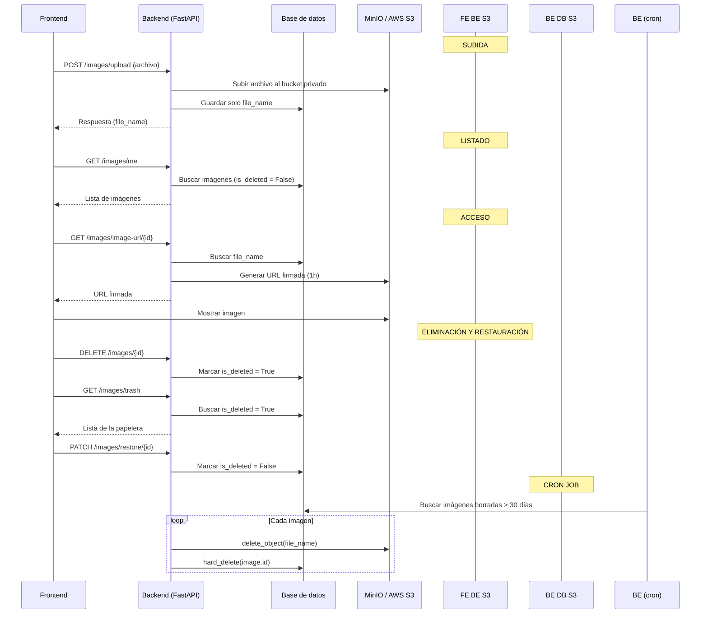

# 📦 Gestión de imágenes con MinIO / AWS S3 (URLs firmadas + Papelera + Cron Job)
Este módulo implementa un sistema completo para **subida, gestión y eliminación de imágenes, compatible con MinIO en local y AWS S3 en producción**, con máxima seguridad y escalabilidad.

## 1️⃣ ¿Qué hemos hecho?
- **Bucket privado**: las imágenes no son públicas en el bucket.

- **URLs firmadas (Signed URLs)**: el backend genera URLs temporales con expiración para acceder a las imágenes.

- **Soft Delete**: al eliminar una imagen no se borra inmediatamente, sino que se marca con ```is_deleted = True```.

- **Papelera**: el usuario puede restaurar imágenes eliminadas antes de 30 días.

- **Cron Job**: cada medianoche elimina definitivamente las imágenes que lleven más de 30 días en la papelera.

## 2️⃣ Flujo general


## 3️⃣ Configuración de MinIO / AWS S3

### Docker Compose (MinIO local)
```
minio:
  image: minio/minio
  container_name: minio
  ports:
    - "9000:9000"
    - "9001:9001"
  environment:
    MINIO_ROOT_USER: minioadmin
    MINIO_ROOT_PASSWORD: minioadmin
  command: server /data --console-address ":9001"
  volumes:
    - ./data/minio:/data

```
- Consola web: http://localhost:9001

- API interna: http://minio:9000

#### Variables de entorno**

**Local con MinIO**

```
MINIO_ENDPOINT=http://minio:9000
MINIO_PUBLIC_HOST=http://localhost:9000
MINIO_BUCKET=images
MINIO_ACCESS_KEY=minioadmin
MINIO_SECRET_KEY=minioadmin
USE_SSL=false

```
- ```MINIO_PUBLIC_HOST``` es necesario para que las URLs firmadas devueltas sean accesibles desde el navegador (no usar el host interno ```minio:9000```).

**Producción con AWS S3**
```
MINIO_ENDPOINT=
MINIO_PUBLIC_HOST=
MINIO_BUCKET=mi-bucket
MINIO_ACCESS_KEY=AWS_ACCESS_KEY_ID
MINIO_SECRET_KEY=AWS_SECRET_ACCESS_KEY
USE_SSL=true

```
- En AWS S3 no hace falta MINIO_PUBLIC_HOST, porque los endpoints de Amazon ya son accesibles públicamente.

## 4️⃣ Código clave en el backend

**Cliente S3 compatible (MinIO / AWS S3)**
```py
# infrastructure/s3/s3_client.py
import boto3, os

s3_client = boto3.client(
    "s3",
    aws_access_key_id=os.getenv("MINIO_ACCESS_KEY"),
    aws_secret_access_key=os.getenv("MINIO_SECRET_KEY"),
    endpoint_url=os.getenv("MINIO_ENDPOINT") or None,
    region_name="us-east-1",
    use_ssl=os.getenv("USE_SSL", "false").lower() == "true"
)

```

**Subida de imágenes privadas**
```py
class UploadImageUseCase:
    def execute(self, dto: ImageCreateDTO, file_obj) -> Image:
        s3_client.upload_fileobj(file_obj, settings.minio_bucket, dto.file_name)
        dto.url = dto.file_name  # Guardamos solo el file_name
        return self.image_repository.save(ImageMapper.from_create_dto(dto))

```

**Generación de URLs firmadas**
```py
class GetSignedImageUrlUseCase:
    def execute(self, file_name: str, expires_in: int = 3600) -> str:
        url = s3_client.generate_presigned_url(
            'get_object',
            Params={'Bucket': settings.minio_bucket, 'Key': file_name},
            ExpiresIn=expires_in
        )

        # Si estamos en MinIO local, reemplazamos el host interno
        if settings.minio_endpoint and "amazonaws.com" not in url:
            internal_host = settings.minio_endpoint.replace("http://", "").replace("https://", "")
            public_host = os.getenv("MINIO_PUBLIC_HOST", "http://localhost:9000")
            return url.replace(internal_host, public_host.replace("http://", "").replace("https://", ""))

        return url

```

**Soft delete y restauración**
```py
class SoftDeleteImageUseCase:
    def execute(self, image_id: UUID):
        img = self.image_repository.get_by_id(image_id)
        img.is_deleted = True
        img.deleted_at = datetime.utcnow()
        self.image_repository.save(img)

class RestoreImageUseCase:
    def execute(self, image_id: UUID):
        img = self.image_repository.get_by_id(image_id)
        img.is_deleted = False
        img.deleted_at = None
        self.image_repository.save(img)

```

**Cron Job (eliminación definitiva)**
```py
def delete_old_images():
    limit_date = datetime.utcnow() - timedelta(days=30)
    old_images = repo.find_deleted_before(limit_date)

    for img in old_images:
        s3_client.delete_object(Bucket=settings.minio_bucket, Key=img.file_name)
        repo.hard_delete(img.id)

```

- Se registra en ```main.py```:

```py
scheduler = BackgroundScheduler()
scheduler.add_job(delete_old_images, "cron", hour=0, minute=0)
scheduler.start()

```

## 5️⃣ Frontend (Next.js con Context)
- **ImageContext**: mantiene dos estados globales:

    - images: imágenes activas con sus URLs firmadas.

    - trash: imágenes eliminadas (papelera).

- Métodos expuestos:

    - ```addImage```: añadir una nueva imagen subida.

    - ```deleteImage```: eliminar (soft delete).

    - ```restoreFromTrash```: restaurar desde la papelera.

    - ```refreshImages y refreshTrash```: refrescar listas.

```tsx
const { images, trash, deleteImage, restoreFromTrash } = useImageContext();

<button onClick={() => deleteImage(img.id)}>Eliminar</button>

<button onClick={() => restoreFromTrash(img.id)}>Restaurar</button>

```

## 6️⃣ Ventajas del sistema

- Seguridad: los archivos nunca son públicos, solo accesibles mediante URLs firmadas.

- Escalabilidad: el mismo código funciona en MinIO y AWS S3.

- Experiencia de usuario: los usuarios pueden restaurar imágenes borradas.

- Mantenimiento automático: el cron elimina basura automáticamente.