# 🎨 Frontend - Gestión de imágenes con ImageContext (Next.js)
Este README documenta cómo el frontend en **Next.js (TypeScript)** interactúa con el backend para gestionar imágenes privadas (MinIO / AWS S3) mediante **URLs firmadas, soft delete, papelera y cron job**.

## 1️⃣ Estructura general del frontend
La lógica está organizada en:

```
app/
  services/
    imageService.ts      # Llamadas a la API
context/
    ImageContext.tsx     # Estado global de imágenes
components/
    ImageUpload.tsx      # Subir imágenes
    ImageList.tsx        # Listado de imágenes activas
    TrashList.tsx        # Listado de imágenes eliminadas (papelera)

```

## 2️⃣ Llamadas a la API (imageService)
```ts
import axios from "axios";

const API_BASE = process.env.NEXT_PUBLIC_API_URL || "http://localhost:8000";

export interface ImageResponse {
  id: string;
  file_name: string;
  user_id: string;
  created_at: string;
  is_deleted: boolean;
}

export const uploadImage = async (file: File, token: string): Promise<ImageResponse> => {
  const formData = new FormData();
  formData.append("file", file);

  const res = await axios.post(`${API_BASE}/images/upload`, formData, {
    headers: {
      "Content-Type": "multipart/form-data",
      Authorization: `Bearer ${token}`,
    },
  });
  return res.data;
};

export const listMyImages = async (token: string): Promise<ImageResponse[]> => {
  const res = await axios.get(`${API_BASE}/images/me`, {
    headers: { Authorization: `Bearer ${token}` },
  });
  return res.data;
};

export const listDeletedImages = async (token: string): Promise<ImageResponse[]> => {
  const res = await axios.get(`${API_BASE}/images/trash`, {
    headers: { Authorization: `Bearer ${token}` },
  });
  return res.data;
};

export const getSignedImageUrl = async (imageId: string, token: string): Promise<string> => {
  const res = await axios.get(`${API_BASE}/images/image-url/${imageId}`, {
    headers: { Authorization: `Bearer ${token}` },
  });
  return res.data.url;
};

export const restoreImage = async (imageId: string, token: string) => {
  await axios.patch(`${API_BASE}/images/restore/${imageId}`, {}, {
    headers: { Authorization: `Bearer ${token}` },
  });
};

```

## 3️⃣ Estado global con ImageContext
El contexto centraliza:

- images: imágenes activas con sus URLs firmadas.

- trash: imágenes eliminadas (papelera).

- Métodos para añadir, eliminar y restaurar imágenes.

```tsx
"use client";
import React, { createContext, useContext, useEffect, useState } from "react";
import { listMyImages, ImageResponse, getSignedImageUrl, listDeletedImages, restoreImage } from "@/app/services/imageService";
import { AuthContext } from "./AuthContext";
import axios from "axios";

interface ImageWithSignedUrl extends ImageResponse {
  signedUrl?: string;
}

interface ImageContextType {
  images: ImageWithSignedUrl[];
  trash: ImageWithSignedUrl[];
  addImage: (image: ImageResponse) => void;
  deleteImage: (imageId: string) => void;
  refreshImages: () => void;
  refreshTrash: () => void;
  restoreFromTrash: (imageId: string) => void;
}

const ImageContext = createContext<ImageContextType | null>(null);

export const ImageProvider: React.FC<{ children: React.ReactNode }> = ({ children }) => {
  const { token } = useContext(AuthContext);
  const [images, setImages] = useState<ImageWithSignedUrl[]>([]);
  const [trash, setTrash] = useState<ImageWithSignedUrl[]>([]);

  const fetchSignedUrls = async (images: ImageResponse[]): Promise<ImageWithSignedUrl[]> => {
    return Promise.all(
      images.map(async (img) => {
        const url = await getSignedImageUrl(img.id, token);
        return { ...img, signedUrl: url };
      })
    );
  };

  const refreshImages = async () => {
    const imgs = await listMyImages(token);
    setImages(await fetchSignedUrls(imgs));
  };

  const refreshTrash = async () => {
    const imgs = await listDeletedImages(token);
    setTrash(await fetchSignedUrls(imgs));
  };

  const addImage = async (image: ImageResponse) => {
    const signedUrl = await getSignedImageUrl(image.id, token);
    setImages((prev) => [{ ...image, signedUrl }, ...prev]);
  };

  const deleteImage = async (imageId: string) => {
    await axios.delete(`${API_BASE}/images/${imageId}`, {
      headers: { Authorization: `Bearer ${token}` },
    });
    setImages((prev) => prev.filter((img) => img.id !== imageId));
    refreshTrash();
  };

  const restoreFromTrash = async (imageId: string) => {
    await restoreImage(imageId, token);
    const restored = trash.find((img) => img.id === imageId);
    if (restored) {
      setTrash((prev) => prev.filter((img) => img.id !== imageId));
      setImages((prev) => [restored, ...prev]);
    }
  };

  useEffect(() => {
    refreshImages();
    refreshTrash();
  }, []);

  return (
    <ImageContext.Provider value={{ images, trash, addImage, deleteImage, refreshImages, refreshTrash, restoreFromTrash }}>
      {children}
    </ImageContext.Provider>
  );
};

export const useImageContext = () => {
  const ctx = useContext(ImageContext);
  if (!ctx) throw new Error("useImageContext debe estar dentro de ImageProvider");
  return ctx;
};

```

## 4️⃣ Componentes
### 4.1 ImageUpload.tsx
Sube imágenes y actualiza el estado global.

```tsx
"use client";
import React, { useContext, useState } from "react";
import { uploadImage } from "@/app/services/imageService";
import { useImageContext } from "@/context/ImageContext";
import { AuthContext } from "@/context/AuthContext";

export const ImageUpload: React.FC = () => {
  const { token } = useContext(AuthContext);
  const { addImage } = useImageContext();
  const [file, setFile] = useState<File | null>(null);
  const [loading, setLoading] = useState(false);

  const handleUpload = async () => {
    if (!file) return;
    setLoading(true);
    try {
      const newImage = await uploadImage(file, token);
      await addImage(newImage);
      setFile(null);
    } finally {
      setLoading(false);
    }
  };

  return (
    <div>
      <input type="file" onChange={(e) => setFile(e.target.files?.[0] || null)} />
      <button disabled={!file || loading} onClick={handleUpload}>
        {loading ? "Subiendo..." : "Subir imagen"}
      </button>
    </div>
  );
};

```

### 4.2 ImageList.tsx
Muestra imágenes activas con opción de eliminación (soft delete).
```tsx
"use client";
import React from "react";
import { useImageContext } from "@/context/ImageContext";

export const ImageList: React.FC = () => {
  const { images, deleteImage } = useImageContext();

  if (images.length === 0) return <p>No tienes imágenes</p>;

  return (
    <div className="grid grid-cols-3 gap-4">
      {images.map((img) => (
        <div key={img.id}>
          
          <button onClick={() => deleteImage(img.id)}>Eliminar</button>
        </div>
      ))}
    </div>
  );
};

```

### 4.3 TrashList.tsx
Muestra imágenes de la papelera con opción de restaurar.
```tsx
"use client";
import { useImageContext } from "@/context/ImageContext";

export const TrashList: React.FC = () => {
  const { trash, restoreFromTrash } = useImageContext();

  if (trash.length === 0) return <p>No tienes imágenes en la papelera</p>;

  return (
    <div className="grid grid-cols-3 gap-4">
      {trash.map((img) => (
        <div key={img.id}>
          
          <button onClick={() => restoreFromTrash(img.id)}>Restaurar</button>
        </div>
      ))}
    </div>
  );
};

```

## 5️⃣ Flujo del frontend

```mermaid
sequenceDiagram
    participant UI as UI (ImageList / TrashList)
    participant IC as ImageContext
    participant API as Backend API

    Note over UI,IC: LISTAR
    UI->>IC: useImageContext()
    IC->>API: GET /images/me y /images/trash
    IC->>API: GET /images/image-url/{id} (signed URL)
    API-->>IC: Lista con signed URLs
    IC-->>UI: Renderiza imágenes

    Note over UI,IC: SUBIR
    UI->>IC: addImage(newImage)
    IC->>API: GET /images/image-url/{id}
    IC-->>UI: Actualiza estado global

    Note over UI,IC: ELIMINAR
    UI->>IC: deleteImage(imageId)
    IC->>API: DELETE /images/{id}
    IC-->>UI: Quita de images[], añade a trash[]

    Note over UI,IC: RESTAURAR
    UI->>IC: restoreFromTrash(imageId)
    IC->>API: PATCH /images/restore/{id}
    IC-->>UI: Quita de trash[], añade a images[]

```


## 6️⃣ Ventajas de este enfoque
- ✅ Estado centralizado de imágenes y papelera.
- ✅ Actualización en tiempo real sin recargar la página.
- ✅ Compatibilidad total con el backend (URLs firmadas + soft delete).
- ✅ Extensible: en el futuro se pueden añadir estadísticas o tags a las imágenes fácilmente.

