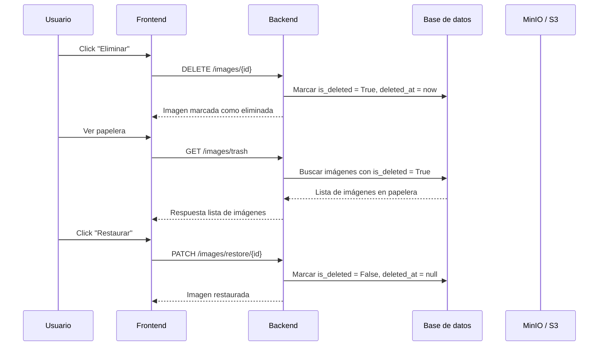
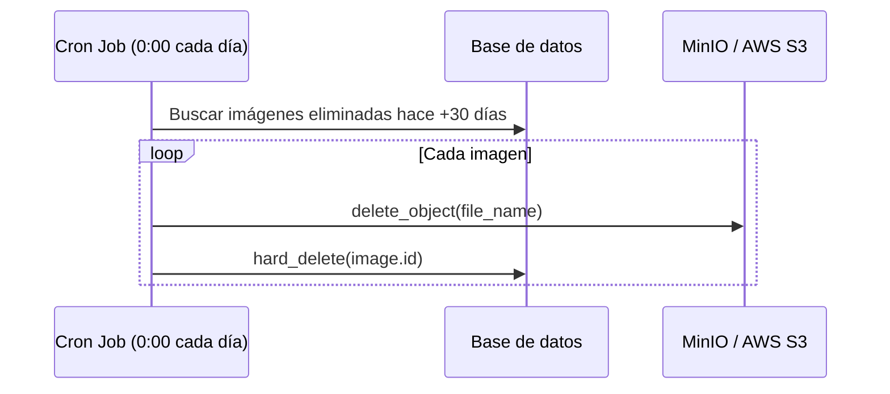

# Gestión de imágenes con Soft Delete, Papelera, Restauración y Cron Job

Este módulo extiende el sistema de imágenes (MinIO/AWS S3 + URLs firmadas) añadiendo:

1. Eliminación lógica (soft delete): las imágenes no se eliminan inmediatamente, sino que se marcan como borradas (is_deleted = True).

2. Papelera (trash): los usuarios pueden ver y restaurar imágenes borradas antes de que se eliminen definitivamente.

3. Cron Job: Se ejecuta cada medianoche y elimina definitivamente las imágenes marcadas como borradas hace más de 30 días (de la base de datos y del bucket S3/MinIO).

## 1️⃣ Cambios en el modelo de datos
Se añadieron las columnas:
```py
# domain/entities/image_entity.py
@dataclass
class Image:
    id: UUID
    user_id: UUID
    file_name: str
    url: str
    created_at: Optional[datetime] = None
    is_deleted: bool = False         # nueva columna
    deleted_at: Optional[datetime] = None  # nueva columna

```

En la tabla ```ImageModel```:

```py
is_deleted = Column(Boolean, default=False)
deleted_at = Column(DateTime, nullable=True)

```
## 2️⃣ Flujo de eliminación (Soft Delete)
Cuando el usuario elimina una imagen:
```py
# application/use_cases/image_use_cases/soft_delete_image_use_case.py
class SoftDeleteImageUseCase:
    def __init__(self, image_repository: ImageRepository):
        self.image_repository = image_repository

    def execute(self, image_id: UUID):
        image = self.image_repository.get_by_id(image_id)
        image.is_deleted = True
        image.deleted_at = datetime.utcnow()
        self.image_repository.save(image)

```

En el router:

```py
@router.delete("/{image_id}")
def delete_image(image_id: UUID, current_user=Depends(get_current_user), db: Session = Depends(get_db)):
    repo = ImageRepositoryImpl(db)
    SoftDeleteImageUseCase(repo).execute(image_id)
    return {"message": "Imagen eliminada correctamente"}

```

## 3️⃣ Papelera (Trash)
Se añadieron endpoints:

**Listar imágenes en la papelera**
```py
@router.get("/trash")
def list_deleted_images(db: Session = Depends(get_db), current_user=Depends(get_current_user)):
    repo = ImageRepositoryImpl(db)
    return [ImageMapper.to_response_dto(i) for i in repo.find_deleted_by_user(current_user.id)]

```

**Restaurar una imagen**
```py
@router.patch("/restore/{image_id}")
def restore_image(image_id: UUID, db: Session = Depends(get_db)):
    repo = ImageRepositoryImpl(db)
    RestoreImageUseCase(repo).execute(image_id)
    return {"message": "Imagen restaurada"}

```
- Caso de uso:

```py
class RestoreImageUseCase:
    def __init__(self, image_repository: ImageRepository):
        self.image_repository = image_repository

    def execute(self, image_id: UUID):
        img = self.image_repository.get_by_id(image_id)
        img.is_deleted = False
        img.deleted_at = None
        self.image_repository.save(img)

```

## 4️⃣ Cron Job: eliminación definitiva
Cada medianoche, se ejecuta una tarea que elimina definitivamente de MinIO y de la base de datos las imágenes borradas hace más de 30 días.

```py
# infrastructure/scheduler/delete_old_images.py
def delete_old_images():
    limit_date = datetime.utcnow() - timedelta(days=30)
    old_images = repo.find_deleted_before(limit_date)

    for img in old_images:
        s3_client.delete_object(Bucket=settings.minio_bucket, Key=img.file_name)
        repo.hard_delete(img.id)

```

Se registra en ```main.py```:

```py
scheduler = BackgroundScheduler()
scheduler.add_job(delete_old_images, "cron", hour=0, minute=0)
scheduler.start()

```

## 5️⃣ Flujo en el frontend
El ImageContext mantiene dos estados:

- images: imágenes activas

- trash: imágenes borradas (papelera)

Ejemplo de restaurar:
```tsx
const { trash, restoreFromTrash } = useImageContext();
<button onClick={() => restoreFromTrash(img.id)}>Restaurar</button>

```

Cuando se elimina una imagen:

```tsx
<button onClick={() => deleteImage(img.id)}>Eliminar</button>

```
- Se elimina de la lista images.

- Pasa automáticamente a trash si se vuelve a pedir el listado.

## 6️⃣ Flujos de comportamiento

**Flujo de eliminación y restauración**


**Flujo del cron job**


## 7️⃣ Ventajas de este enfoque
- Los usuarios pueden recuperar imágenes eliminadas durante un periodo de gracia (30 días).

- El almacenamiento en MinIO/AWS S3 no se llena de basura porque el cron las borra definitivamente.

- El sistema es compatible con el flujo de URLs firmadas, las imágenes borradas no aparecen en el listado de activas.

- La lógica está desacoplada:

- Backend controla el ciclo de vida.

- Frontend se alimenta de estados (images, trash) mediante el contexto.
