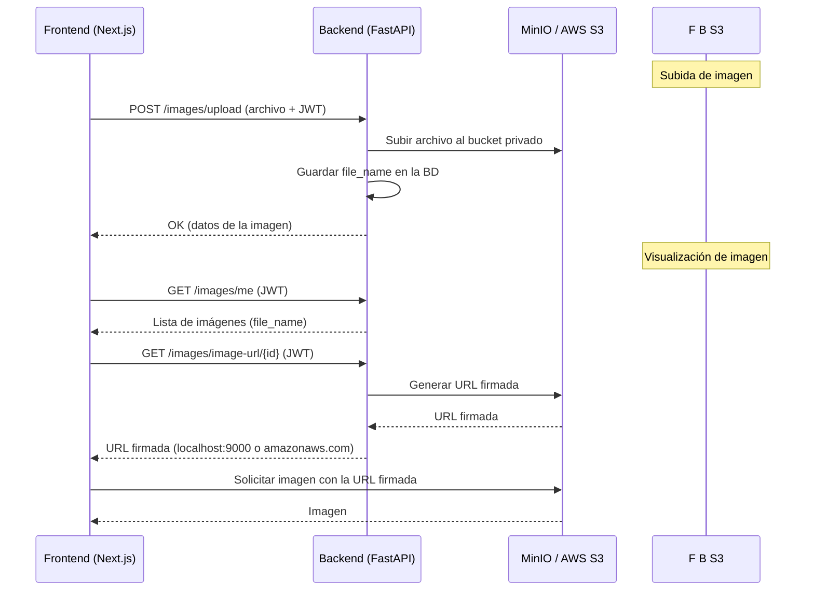

# 1. Archivos del frontend
## 1.1 imageService.ts (servicios HTTP - desde donde se harán las llamadas a la API)
Se definen los métodos para interactuar con los endpoints del backend.
Todos reciben el **token JWT** desde los componentes (mediante el ```AuthContext```) como parámetro para incluirlo en el header Authorization.

```ts
import axios from "axios";

const API_BASE = process.env.NEXT_PUBLIC_API_URL || "http://localhost:8000";

export interface ImageResponse {
  id: string;
  file_name: string;
  user_id: string;
  created_at: string;
}

export const uploadImage = async (file: File, token: string): Promise<ImageResponse> => {
  const formData = new FormData();
  formData.append("file", file);

  const res = await axios.post(`${API_BASE}/images/upload`, formData, {
    headers: {
      "Content-Type": "multipart/form-data",
      Authorization: `Bearer ${token}`,
    },
  });

  return res.data;
};

export const listMyImages = async (token: string): Promise<ImageResponse[]> => {
  const res = await axios.get(`${API_BASE}/images/me`, {
    headers: { Authorization: `Bearer ${token}` },
  });
  return res.data;
};

export const getSignedImageUrl = async (imageId: string, token: string): Promise<string> => {
  const res = await axios.get(`${API_BASE}/images/image-url/${imageId}`, {
    headers: { Authorization: `Bearer ${token}` },
  });
  return res.data.url;
};
```

## 1.2 useSignedImageUrl.ts (hook personalizado)
Este hook obtiene la **URL firmada** desde el backend. Si la URL caduca, puedes volver a llamarlo

```ts
import { useEffect, useState } from "react";
import { getSignedImageUrl } from "../services/imageService";

export const useSignedImageUrl = (imageId: string | null, token: string | null) => {
  const [url, setUrl] = useState<string | null>(null);
  const [loading, setLoading] = useState(true);

  useEffect(() => {
    if (!imageId || !token) return;

    setLoading(true);
    getSignedImageUrl(imageId, token)
      .then((signedUrl) => setUrl(signedUrl))
      .finally(() => setLoading(false));
  }, [imageId, token]);

  return { url, loading };
};
```

## 1.3 ImageUpload.tsx (subida de imágenes)
Permite seleccionar un archivo y subirlo al backend.

```tsx
"use client";
import React, { useState, useContext } from "react";
import { uploadImage } from "../services/imageService";
import { AuthContext } from "@/context/AuthContext";

export const ImageUpload: React.FC<{ onUploaded: () => void }> = ({ onUploaded }) => {
  const [file, setFile] = useState<File | null>(null);
  const [loading, setLoading] = useState(false);
  const { token } = useContext(AuthContext);

  const handleUpload = async () => {
    if (!file || !token) return;
    setLoading(true);
    try {
      await uploadImage(file, token);
      onUploaded(); // refresca la lista
      setFile(null);
    } finally {
      setLoading(false);
    }
  };

  return (
    <div className="p-4 border rounded flex gap-2 items-center">
      <input type="file" onChange={(e) => setFile(e.target.files?.[0] || null)} />
      <button
        type="button"
        className="px-3 py-1 bg-blue-600 text-white rounded"
        disabled={!file || loading}
        onClick={handleUpload}
      >
        {loading ? "Subiendo..." : "Subir imagen"}
      </button>
    </div>
  );
};
```


## 1.4 SignedImage.tsx (mostrar imágenes)
Muestra la imagen usando la URL firmada obtenida por el hook.

```tsx
"use client";
import React, { useContext } from "react";
import { useSignedImageUrl } from "../hooks/useSignedImageUrl";
import { AuthContext } from "@/context/AuthContext";

export const SignedImage: React.FC<{ imageId: string; alt?: string }> = ({ imageId, alt }) => {
  const { token } = useContext(AuthContext);
  const { url, loading } = useSignedImageUrl(imageId, token);

  if (loading) return <p>Cargando...</p>;
  if (!url) return <p>Error cargando imagen</p>;

  return ;
};
```

## 1.5 ImageList.tsx (listado de imágenes)
Lista todas las imágenes del usuario y utiliza el componente ```SignedImage``` para mostrarlas.
```tsx
"use client";
import React, { useEffect, useState, useContext } from "react";
import { listMyImages, ImageResponse } from "../services/imageService";
import { SignedImage } from "./SignedImage";
import { AuthContext } from "@/context/AuthContext";

export const ImageList: React.FC = () => {
  const { token } = useContext(AuthContext);
  const [images, setImages] = useState<ImageResponse[]>([]);
  const [loading, setLoading] = useState(true);

  const fetchImages = async () => {
    if (!token) return;
    setLoading(true);
    try {
      const data = await listMyImages(token);
      setImages(data);
    } finally {
      setLoading(false);
    }
  };

  useEffect(() => {
    fetchImages();
  }, [token]);

  if (loading) return <p>Cargando imágenes...</p>;
  if (images.length === 0) return <p>No tienes imágenes</p>;

  return (
    <div className="grid grid-cols-3 gap-4">
      {images.map((img) => (
        <div key={img.id} className="border p-2 rounded">
          <SignedImage imageId={img.id} />
        </div>
      ))}
    </div>
  );
};
```

## 2. Flujo completo (Frontend + Backend)



## 3. Ventajas

- Frontend desacoplado: el token se maneja en el AuthContext y los servicios son puros.

- Buckets privados: las imágenes no están accesibles públicamente.

- Compatibilidad 100% con AWS S3: solo se cambian las variables de entorno al pasar a producción.

- URLs firmadas: expiran tras un tiempo configurable (por defecto 1h).


**Conclusión**: Ahora tenemos un sistema robusto de almacenamiento de imágenes privadas, con acceso controlado mediante URLs firmadas. Perfecto para entornos de producción.


1.6 page.tsx (página principal)
'use client'
import React from 'react'
import { ImageUpload } from '@/components/ImageUpload'
import { ImageList } from '@/components/ImageList'

const page = () => {
  const refresh = () => window.location.reload();
  return (
    <>
     
        <h1 className="text-xl mb-4 font-bold">Gestión de Imágenes</h1>
        <ImageUpload onUploaded={refresh} />
        <div className="mt-6">
          <ImageList />
        </div>
    
    </>
    
  )
}

export default page
