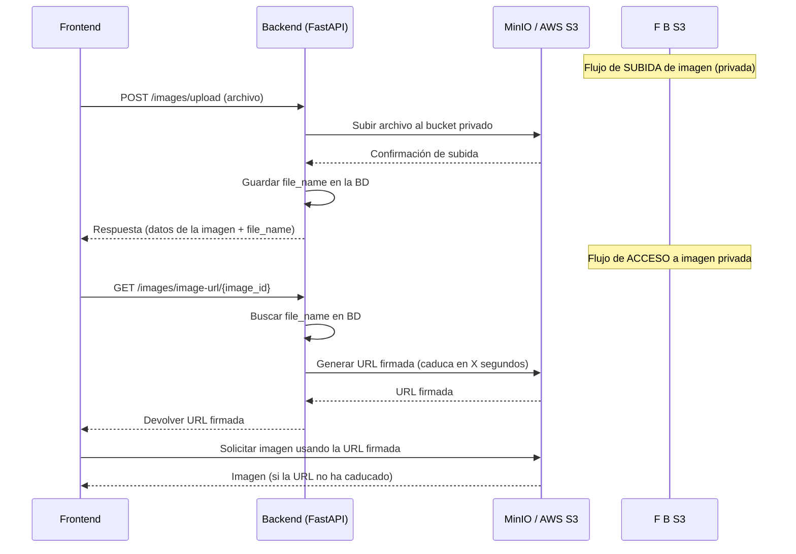

# Gestión de imágenes privadas con URLs firmadas (MinIO / AWS S3)
## 1. ¿Qué hemos hecho?
Lo que implementamos se llama:
**"Acceso a objetos mediante URLs firmadas (Signed URLs)"**
o en inglés **"Presigned URLs for private buckets"**.

- El bucket está en modo privado (o no expone URLs públicas).


- Cuando un usuario necesita acceder a un objeto (imagen), el backend genera una URL firmada (signed URL) con una firma digital y un tiempo de expiración.


- Esa URL da acceso temporal al objeto sin necesidad de credenciales.


Hemos adaptado el sistema de imágenes para que los archivos no sean públicos en MinIO (o AWS S3).
En lugar de exponer directamente la URL pública, ahora generamos URLs firmadas que **caducan tras X minutos**.
Este es el mismo sistema que usan las aplicaciones en producción cuando trabajan con buckets privados.

## 2. ¿Por qué este cambio?
- Si el bucket es público, cualquiera que obtenga la URL podría acceder a las imágenes.

- Con buckets privados, las imágenes solo se pueden acceder mediante una URL firmada.

- La URL firmada es generada desde el backend y tiene una fecha de expiración (ej. 1 hora).


### 2.1 ¿Hay que hacer algo para poner el bucket “privado"?
- MinIO: por defecto ya es privado. Si no defines políticas de bucket públicas, solo el usuario con MINIO_ACCESS_KEY y MINIO_SECRET_KEY puede acceder.

- AWS S3: por defecto los buckets también son privados.

- Si alguna vez le pusiste una política pública a tu bucket images, quítala (o no la pongas).


Resumiendo: **ya está privado por defecto**. Las imágenes no se pueden abrir por URL sin la firma.


### 2.2 ¿MinIO pone los buckets privados por defecto?
Sí, MinIO por defecto no expone buckets públicamente.

- Si intentas abrir en el navegador la URL http://localhost:9000/images/imagen.jpg, te pedirá credenciales.

- Lo que pasaba antes es que nosotros montábamos la URL con el endpoint + bucket + file_name y lo devolvíamos, y el navegador podía acceder porque MinIO estaba corriendo localmente y sin políticas estrictas.

- En producción (AWS S3 o MinIO en servidor) esas URLs darían un 403 Forbidden si el bucket es privado.

- Ahora con las URLs firmadas, aunque el bucket sea privado, el usuario puede acceder temporalmente porque la URL incluye un token de acceso que MinIO o S3 valida.


### 2.3 ¿Por qué antes funcionaba con URL directa?
Antes el bucket seguía siendo privado, pero:
- Usabas el endpoint de MinIO local (localhost) y podía acceder sin restricciones por estar en el mismo entorno.

- Ahora que queremos seguridad real y migrar a AWS, las URLs públicas no son opción → pasamos al sistema de signed URLs.

## 3. Flujo completo
### 3.1 Subida de imagen (privada)

- Endpoint: POST /images/upload

- La imagen se sube a MinIO / S3 pero el bucket es privado.

- En la base de datos **solo guardamos el file_name** (key del archivo en el bucket).


### 3.2 Listado de imágenes

- Endpoint: GET /images/me

- Devuelve el listado de imágenes del usuario, pero **sin** la URL pública.

- El frontend obtiene el id de la imagen o el file_name.


### 3.3 Obtener URL firmada

- Endpoint: GET /images/image-url/{image_id}

- Busca la imagen en la BD y genera una URL firmada usando ```boto3```:
```
s3_client.generate_presigned_url(
    'get_object',
    Params={'Bucket': bucket_name, 'Key': file_name},
    ExpiresIn=3600  # 1 hora
)
```

- Devuelve al frontend una URL temporal válida solo durante el tiempo definido.


## 4. Cambios principales en el código

### 4.1 UploadImageUseCase
Ya **no guarda URL pública**, solo el file_name en la BD:
```dto.url = dto.file_name```

### 4.2 Nuevo caso de uso: GetSignedImageUrlUseCase
Genera la URL firmada:

```python
from infrastructure.s3.s3_client import s3_client
from config import settings
from fastapi import HTTPException

class GetSignedImageUrlUseCase:
    """Genera una URL firmada temporal para una imagen privada"""

    def execute(self, file_name: str, expires_in: int = 3600) -> str:
        try:
            url = s3_client.generate_presigned_url(
                'get_object',
                Params={'Bucket': settings.minio_bucket, 'Key': file_name},
                ExpiresIn=expires_in
            )
            return url
        except Exception as e:
            raise HTTPException(status_code=500, detail=f"Error generando URL firmada: {e}")
```


### 4.3 Endpoint /images/image-url/{id}
Llama a GetSignedImageUrlUseCase y devuelve la URL firmada:

```python
@router.get("/image-url/{image_id}")
def get_image_url(image_id: str, db: Session = Depends(get_db)):
    image = image_repository.get_by_id(image_id)
    signed_url = GetSignedImageUrlUseCase().execute(image.url)
    return {"url": signed_url}
```

### 4.5  Añadir el método get_by_id en la interfaz ImageRepository
En domain/repositories/image_repository.py:

```python
from abc import ABC, abstractmethod
from domain.entities.image_entity import Image
from typing import List, Optional
from uuid import UUID

class ImageRepository(ABC):

    @abstractmethod
    def save(self, image: Image) -> Image:
        pass

    @abstractmethod
    def find_by_user_id(self, user_id: UUID) -> List[Image]:
        pass

    @abstractmethod
    def get_by_id(self, image_id: UUID) -> Optional[Image]:   # 👈 nuevo
        pass
```

### 4.6. Implementar el método en ImageRepositoryImpl
En infrastructure/db/repositories/image_repository_impl.py:
```python
from domain.repositories.image_repository import ImageRepository
from domain.entities.image_entity import Image
from infrastructure.db.models.image_model import ImageModel
from infrastructure.mappers.image_mapper import ImageMapper
from sqlalchemy.orm import Session
from typing import List, Optional
from uuid import UUID

class ImageRepositoryImpl(ImageRepository):
    def __init__(self, db: Session):
        self.db = db

    def save(self, image: Image) -> Image:
        model = ImageMapper.to_model(image)
        self.db.add(model)
        self.db.commit()
        self.db.refresh(model)
        return ImageMapper.to_entity(model)

    def find_by_user_id(self, user_id: UUID) -> List[Image]:
        models = self.db.query(ImageModel).filter(ImageModel.user_id == user_id).all()
        return [ImageMapper.to_entity(m) for m in models]

    def get_by_id(self, image_id: UUID) -> Optional[Image]:    # 👈 nuevo
        model = self.db.query(ImageModel).filter(ImageModel.id == image_id).first()
        if not model:
            return None
        return ImageMapper.to_entity(model)
```

## 5. Ventajas de este enfoque
- Las imágenes no son accesibles públicamente aunque alguien adivine el nombre del archivo.

- Las URLs firmadas caducan tras X minutos (por defecto 1 hora).

- Compatible tanto con MinIO como con AWS S3.

- El frontend siempre debe pedir una URL firmada antes de mostrar una imagen.


## 6. Flujo en el frontend
- Listar imágenes con ```GET /images/me```.

- Por cada imagen, pedir su URL firmada con ```GET /images/image-url/{id}```.

- Mostrar la imagen usando la URL firmada.

- Si caduca, pedir una nueva.


### 6.1. Diagrama del flujo 


## 7. Migración a AWS S3
No hay que cambiar el código, solo las variables de entorno (.env)
```
MINIO_ENDPOINT=
MINIO_BUCKET=<tu-bucket>
MINIO_ACCESS_KEY=<AWS_ACCESS_KEY_ID>
MINIO_SECRET_KEY=<AWS_SECRET_ACCESS_KEY>
USE_SSL=true
```

**Resultado**: Ahora las imágenes están protegidas y el flujo está listo para producción real, tanto en MinIO como en AWS S3.

# ACTUALIZACIÓN

Cuando desarrollamos en local con Docker, el backend accede a MinIO mediante el host interno ```http://minio:9000```.
Sin embargo, al generar las **URLs firmadas**, estas devolvían ese host interno, **el cual no es accesible desde el navegador**, causando errores ```ERR_NAME_NOT_RESOLVED```.
Para resolverlo:

- Se ha añadido la variable MINIO_PUBLIC_HOST en el .env para indicar cuál es el host público que debe usarse al devolver URLs firmadas (```http://localhost:9000``` en local).


- Se ha modificado el caso de uso GetSignedImageUrlUseCase para que reemplace el host interno (minio:9000) por el host público (localhost:9000) en las URLs firmadas.


- En AWS S3 no es necesario hacer este reemplazo porque el host de Amazon ya es accesible públicamente.


## 1. Variables de entorno
#### Local con MinIO
```
MINIO_ENDPOINT=http://minio:9000
MINIO_PUBLIC_HOST=http://localhost:9000
MINIO_BUCKET=images
MINIO_ACCESS_KEY=minioadmin
MINIO_SECRET_KEY=minioadmin
USE_SSL=false
```

**MINIO_PUBLIC_HOST es obligatorio en local para devolver URLs accesibles por navegador**


#### Producción con AWS S3
```
MINIO_ENDPOINT=           # vacío (boto3 usa AWS automáticamente)
MINIO_PUBLIC_HOST=        # vacío (no se necesita)
MINIO_BUCKET=mi-bucket
MINIO_ACCESS_KEY=AWS_ACCESS_KEY_ID
MINIO_SECRET_KEY=AWS_SECRET_ACCESS_KEY
USE_SSL=true
```

## 2. Ajustes en el caso de uso GetSignedImageUrlUseCase
Se ha modificado para reemplazar el host interno de MinIO por el host público en local y soportar AWS S3 en producción.

```python
from infrastructure.s3.s3_client import s3_client
from config import settings
from fastapi import HTTPException
import os

class GetSignedImageUrlUseCase:
    """Genera una URL firmada temporal para una imagen privada"""

    def execute(self, file_name: str, expires_in: int = 3600) -> str:
        try:
            # Generar la URL firmada
            url = s3_client.generate_presigned_url(
                'get_object',
                Params={'Bucket': settings.minio_bucket, 'Key': file_name},
                ExpiresIn=expires_in
            )

            # Si es MinIO (local o servidor privado)
            if settings.minio_endpoint and "amazonaws.com" not in url:
                public_host = os.getenv("MINIO_PUBLIC_HOST", "http://localhost:9000")
                internal_host = settings.minio_endpoint.replace("http://", "").replace("https://", "")

                return url.replace(
                    internal_host,
                    public_host.replace("http://", "").replace("https://", "")
                )

            # Si es AWS S3, devolvemos la URL tal cual
            return url

        except Exception as e:
            raise HTTPException(status_code=500, detail=f"Error generando URL firmada: {e}")
```


## 3. Ventajas

- Las imágenes no son públicas aunque alguien conozca el ```file_name```.

- Las URLs firmadas caducan tras un tiempo configurable.

- El sistema es 100% compatible con AWS S3: en producción no hace falta cambiar nada de código.

- En local (MinIO) las URLs devueltas ya son accesibles desde navegador gracias a ```MINIO_PUBLIC_HOST```.

- Ideal para entornos de producción donde la seguridad es importante.


## 4. El flujo del frontend sigue siendo el mismo
## 4.1. Flujo en el frontend
- Listar imágenes con ```GET /images/me```.

- Por cada imagen, pedir su URL firmada con ```GET /images/image-url/{id}```.

- Mostrar la imagen usando la URL firmada.

- Si caduca, pedir una nueva.

[Pincha aquí para ver la documentación del flujo de subida, obtención y renderizado de imágenes desde el frontend](https://github.com/maigcorrea/fastapi-content-generator/blob/main/docs/gestión_imagenes_frontend.md)

### 4.2. Diagrama del flujo 
