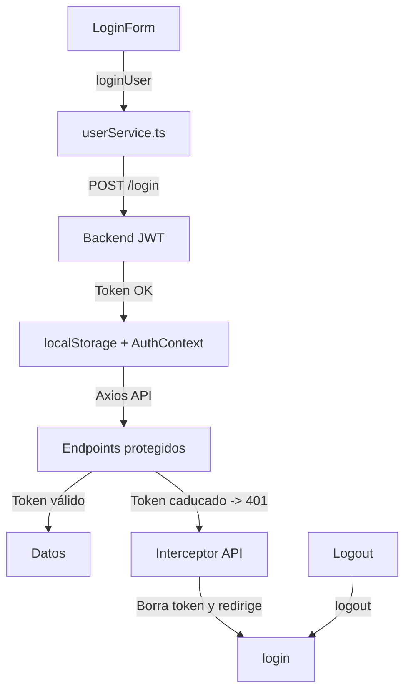

# Autenticación con JWT y manejo de sesión (Next.js + Axios)
Este documento explica cómo está implementado el login, el logout y la gestión del token JWT caducado en el frontend.

## 1️⃣ Flujo de autenticación
1. El usuario se loggea mediante el formulario de LoginForm.

2. El backend devuelve un JWT con un tiempo de expiración (exp).

3. El token se guarda en localStorage y en el estado global del AuthContext.

4. Todas las peticiones posteriores incluyen automáticamente el token en la cabecera Authorization.

5. Si el token caduca y el backend devuelve 401 Unauthorized, el frontend lo detecta y redirige automáticamente al login.

## 2️⃣ AuthContext
📂 context/AuthContext.tsx

- Centraliza el estado de autenticación.

- Guarda y expone:

    - isAdmin: si el usuario es administrador.

    - token: el token JWT.

    - logout(): método para cerrar sesión y limpiar datos.

- Se inicializa leyendo los valores de localStorage al cargar la aplicación.

- Escucha cambios en localStorage para sincronizar el estado entre pestañas.

```tsx
export const AuthContext = createContext<AuthContextType>(/* ... */)

export const AuthProvider = ({ children }: { children: ReactNode }) => {
  const [isAdmin, setIsAdmin] = useState<boolean | null>(() => {
    if (typeof window !== "undefined") {
      const storedAdmin = localStorage.getItem("is_admin")
      return storedAdmin ? storedAdmin === "true" : null
    }
    return null
  })

  const [token, setToken] = useState<string>(() => {
    if (typeof window !== "undefined") {
      return localStorage.getItem("token") || ""
    }
    return ""
  })

  const logout = () => {
    localStorage.clear()
    setIsAdmin(null)
    setToken("")
    router.push("/")
  }

  // Listener para sincronizar logout en múltiples pestañas
  useEffect(() => {
    const handleStorageChange = (e: StorageEvent) => {
      if (e.key === "token") setToken(e.newValue || "")
      if (e.key === "is_admin") setIsAdmin(e.newValue ? e.newValue === "true" : null)
      if (e.key === null) {
        setToken("")
        setIsAdmin(null)
      }
    }
    window.addEventListener("storage", handleStorageChange)
    return () => window.removeEventListener("storage", handleStorageChange)
  }, [])

  return (
    <AuthContext.Provider value={{ isAdmin, setIsAdmin, token, setToken, logout, isLoading: false }}>
      {children}
    </AuthContext.Provider>
  )
}

```

## 3️⃣ Cliente Axios con interceptores
📂 app/services/api.ts

- Añade el token a todas las peticiones automáticamente.

- Detecta el 401 Unauthorized cuando el token caduca:

    - Limpia localStorage.

    - Redirige automáticamente al login.

```ts
import axios from 'axios'

const API = axios.create({
  baseURL: 'http://localhost:8000',
})

// Interceptor de request: añade el token
API.interceptors.request.use((config) => {
  const token = localStorage.getItem('token')
  if (token) config.headers.Authorization = `Bearer ${token}`
  return config
})

// Interceptor de response: detecta token caducado
API.interceptors.response.use(
  (response) => response,
  (error) => {
    if (error.response?.status === 401) {
      localStorage.clear()
      window.location.href = '/login'
    }
    return Promise.reject(error)
  }
)

export default API

```

## 4️⃣ Servicios (userService e imageService)

```userService.ts```
- Usado para login, registro y endpoints sin token (por eso usa axios normal).
```ts
import axios from 'axios'
const API_URL = 'http://localhost:8000/users'

export const loginUser = async (credentials: { email: string; password: string }) => {
  const response = await axios.post(`${API_URL}/login`, credentials)
  return response.data
}

```
```imageService.ts```
Recoge las principales acciones que va a poder realizar el usuario loggeado por lo que usa el cliente API con interceptores para endpoints protegidos.
```ts
import API from './api'

export const listMyImages = async (): Promise<ImageResponse[]> => {
  const res = await API.get(`/images/me`)
  return res.data
}

```

## 5️⃣ LoginForm
📂 app/components/LoginForm.tsx

- Llama a loginUser de userService.ts.

- Guarda el token en localStorage y actualiza el contexto.

- Redirige a la ruta adecuada según el rol (isAdmin).

```tsx
import { loginUser } from '@/app/services/userService'

const handleSubmit = async (e: React.FormEvent) => {
  e.preventDefault()
  try {
    const data = await loginUser(formData)
    localStorage.setItem("token", data.access_token)
    localStorage.setItem("is_admin", String(data.is_admin))
    setToken(data.access_token)
    setIsAdmin(data.is_admin)

    router.push(data.is_admin ? "/admin-panel" : "/dashboard")
  } catch (err) {
    setError("Credenciales incorrectas")
  }
}

```

## 6️⃣ Logout
Se hace desde cualquier parte de la app llamando a logout() del contexto:

```tsx
const { logout } = useContext(AuthContext)

<button onClick={logout}>Cerrar sesión</button>

```

## 7️⃣ ¿Qué pasa cuando el token caduca?
- Si el token está caducado y el backend devuelve un 401, el interceptor de api.ts se ejecuta:

    - Borra localStorage (token + is_admin).

    - Redirige automáticamente a /login.

- Esto asegura que el usuario no siga navegando con sesión inválida.

## Diagrama del flujo


Con esto tienes toda la lógica de autenticación documentada:

- Login y almacenamiento del token.

- Logout y sincronización entre pestañas.

- Manejo de token caducado con interceptores.

