# **🔐 Sistema de Autenticación y Protección de Rutas (Frontend) - Versión antigua - Forma manual**
##Arquitectura General


**1️⃣ Creación del AuthContext**
Se creó un contexto de React (AuthContext) para centralizar el estado de autenticación de la aplicación. Este contexto expone las siguientes propiedades:

- token: token de autenticación del usuario.

- isAdmin: booleano que indica si el usuario es administrador.

- setToken y setIsAdmin: setters para actualizar el estado.

- logout: función que limpia los datos de sesión.

- isLoading: bandera de carga (en la versión final ya no es necesaria, ver optimización).

### Código base inicial
En la versión inicial, el AuthContext obtenía el token y el rol de localStorage usando un useEffect al montar el componente:

```
useEffect(() => {
  const storedToken = localStorage.getItem("token");
  const storedAdmin = localStorage.getItem("is_admin");

  if (storedToken) setToken(storedToken);
  if (storedAdmin) setIsAdmin(storedAdmin === "true");

  setIsLoading(false);
}, []);

```

**2️⃣ Optimización: inicializar estado desde localStorage**
Para evitar el uso de useEffect y posibles parpadeos al renderizar, se optimizó la inicialización del estado directamente en el useState, leyendo localStorage de manera perezosa (lazy initialization):

```
const [isAdmin, setIsAdmin] = useState<boolean | null>(() => {
  const storedAdmin = localStorage.getItem("is_admin");
  return storedAdmin ? storedAdmin === "true" : null;
});

const [token, setToken] = useState<string>(() => {
  return localStorage.getItem("token") || "";
});
```
Con esto, el contexto ya tiene los valores cargados al momento de inicializarse, e isLoading se vuelve opcional.

**3️⃣ Listener de localStorage para sincronización entre pestañas**
Se añadió un listener de eventos storage para detectar cambios en el localStorage hechos desde otras pestañas o ventanas del navegador. Esto permite que el estado de autenticación se sincronice en tiempo real:
```
useEffect(() => {
    const handleStorageChange = (e: StorageEvent) => {
      // Si se cambió el token o is_admin en otra pestaña, actualizamos el contexto
      if (e.key === "token") {
        setToken(e.newValue || "");
      }
      // Si se cambió is_admin en otra pestaña, actualizamos el contexto
      if (e.key === "is_admin") {
        setIsAdmin(e.newValue ? e.newValue === "true" : null);
      }
      // Si se borró el localStorage completo (logout)
      if (e.key === null) {
        setToken("");
        setIsAdmin(null);
      }
    };

    // Añadimos el listener al evento de storage para detectar cambios en localStorage
    window.addEventListener("storage", handleStorageChange);
    // Limpiamos el listener al desmontar el componente
    // Esto es importante para evitar fugas de memoria y comportamientos inesperados
    return () => window.removeEventListener("storage", handleStorageChange);
  }, []);
```

**4️⃣ Actualización del contexto en ciertas partes de la aplicación, por ej el login**
En el formulario de login, al autenticarse correctamente, se guardan los datos en localStorage y se actualiza el contexto para que el resto de la aplicación pueda reaccionar en tiempo real (por ejemplo, mostrar el Navbar con el usuario logueado):

```
localStorage.setItem("token", data.access_token);
localStorage.setItem("is_admin", String(data.is_admin));

// Actualizar contexto
setToken(data.access_token);
setIsAdmin(data.is_admin);
```
Esto permite que, al hacer login, las rutas protegidas se desbloqueen sin necesidad de recargar la página.

**5️⃣ Componente ProtectRoutes.tsx**
Se creó el componente ProtectRoutes para envolver cualquier ruta o sección que deba estar protegida.
Este componente utiliza el AuthContext para comprobar:

- Si el usuario está logueado (token).

- Si la ruta es solo para administradores (adminOnly) y el usuario tiene permisos (isAdmin).

*Ejemplo de uso:*
```
<ProtectRoutes adminOnly>
  <AdminDashboard />
</ProtectRoutes>

```
```
<ProtectRoutes>
  <ProfilePanel />
</ProtectRoutes>

```

*Código simplificado de ProtectRoutes:*
```
const ProtectRoutes: React.FC<ProtectRoutesProps> = ({ children, adminOnly = false }) => {
  const router = useRouter();
  const { token, isAdmin } = useContext(AuthContext);
  const [isAuthorized, setIsAuthorized] = useState(false);

  //Efecto para comprobar permisos cuando cambian los valores del contexto
  useEffect(() => {
    // Si no hay token -> login
    if (!token) {
      router.push("/login");
      return;
    }

    // Si la ruta requiere admin y el usuario no lo es -> permission denied
    if (adminOnly && !isAdmin) {
      router.push("/permission");
      return;
    }

    // Si todo bien -> autorizado
    setIsAuthorized(true);
  }, [token, isAdmin, adminOnly, router]);

  if (!isAuthorized) return null;

  return <>{children}</>;
};

```
#### Flujo de validación de ```ProtectRoutes```


Este componente asegura que:

- Si el usuario no está autenticado, es redirigido al login.

- Si la ruta requiere permisos de administrador y el usuario no lo es, se le redirige a una página de acceso denegado.

- Si todo es correcto, se renderizan los children.

**6️⃣ Flujo completo**

#### Flujo de Login y Logout completo

```mermaid
sequenceDiagram
  participant User
  participant LoginForm
  participant AuthContext
  participant ProtectRoutes
  participant UI

  User->>LoginForm: Ingresa credenciales
  LoginForm->>localStorage: Guarda token & is_admin
  LoginForm->>AuthContext: setToken() & setIsAdmin()
  AuthContext->>UI: Notifica cambio de estado
  UI->>ProtectRoutes: Verifica permisos
  ProtectRoutes->>UI: Renderiza rutas permitidas
  User->>AuthContext: logout()
  AuthContext->>localStorage: clear()
  AuthContext->>UI: Limpia sesión y redirige

```


**1.** Al montar la aplicación, el AuthContext lee el token y el isAdmin directamente desde localStorage.

**2.** Al hacer login, el formulario guarda los datos en localStorage y actualiza el contexto (setToken, setIsAdmin).

**3.** Si hay múltiples pestañas, cualquier cambio en el localStorage (login/logout) se propaga gracias al listener de storage.

**4.** Al navegar por la aplicación, el componente ProtectRoutes se encarga de verificar si el usuario tiene permisos para acceder a la ruta.

**5.** Al hacer logout, se limpia localStorage y se reinicia el contexto, provocando que las rutas protegidas redirijan al login.

## Beneficios de esta implementación
- Centralización del estado de autenticación en un solo lugar (AuthContext).

- Sincronización multi-pestaña: login y logout se propagan en tiempo real.

- Rutas protegidas flexibles: puedes proteger cualquier sección con ProtectRoutes, indicando si es solo para admins (adminOnly).

- Sin parpadeos: al inicializar el contexto directamente desde localStorage, evitamos renderizados intermedios incorrectos.

- UI se actualiza automáticamente al login/logout.